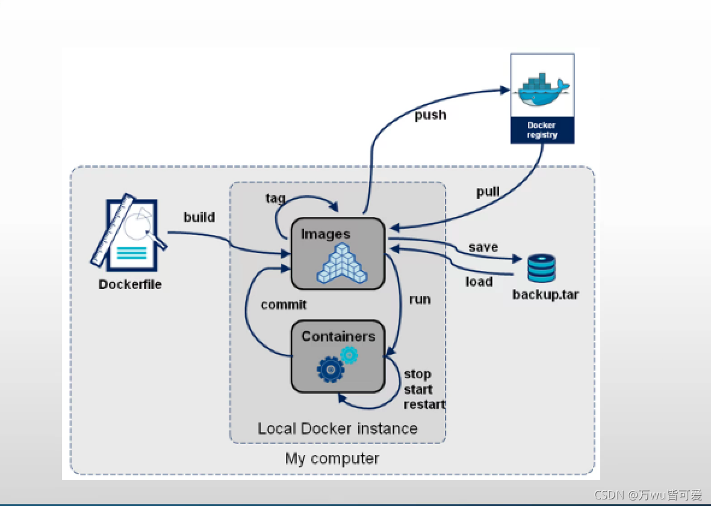
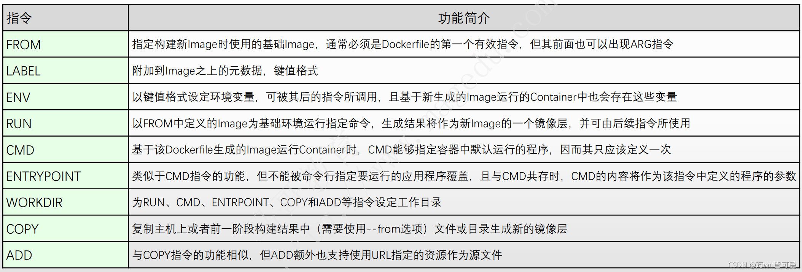
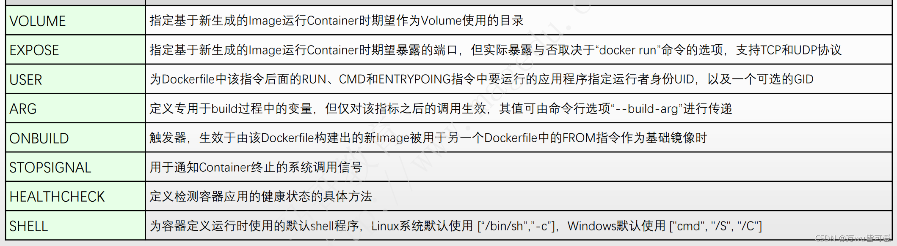

# Docker基础

### 基本架构



### 1、docker基本概念

- **镜像（Image）**：Docker 镜像（Image），就相当于是一个 root 文件系统。比如官方镜像 ubuntu:16.04 就包含了完整的一套 Ubuntu16.04 最小系统的 root 文件系统。
- **容器（Container）**：镜像（Image）和容器（Container）的关系，就像是面向对象程序设计中的类和实例一样，镜像是静态的定义，容器是镜像运行时的实体。容器可以被创建、启动、停止、删除、暂停等。
- **仓库（Repository）**：仓库可看成一个代码控制中心，用来保存镜像。

| Docker | 面向对象 |
| ------ | ---- |
| 容器     | 对象   |
| 镜像     | 类    |
| 仓库     | git  |

| 概念                   | 说明                                                                                                                                                                                                                                                                                              |
| -------------------- | ----------------------------------------------------------------------------------------------------------------------------------------------------------------------------------------------------------------------------------------------------------------------------------------------- |
| Docker 镜像(Images)    | Docker 镜像是用于创建 Docker 容器的模板，比如 Ubuntu 系统。                                                                                                                                                                                                                                                       |
| Docker 容器(Container) | 容器是独立运行的一个或一组应用，是镜像运行时的实体。                                                                                                                                                                                                                                                                      |
| Docker 客户端(Client)   | Docker 客户端通过命令行或者其他工具使用 Docker SDK ([Redirecting&hellip;](https://docs.docker.com/develop/sdk/)) 与 Docker 的守护进程通信。                                                                                                                                                                              |
| Docker 主机(Host)      | 一个物理或者虚拟的机器用于执行 Docker 守护进程和容器。                                                                                                                                                                                                                                                                 |
| Docker Registry      | Docker 仓库用来保存镜像，可以理解为代码控制中的代码仓库。Docker Hub([https://hub.docker.com](https://hub.docker.com/)) 提供了庞大的镜像集合供使用。一个 Docker Registry 中可以包含多个仓库（Repository）；每个仓库可以包含多个标签（Tag）；每个标签对应一个镜像。通常，一个仓库会包含同一个软件不同版本的镜像，而标签就常用于对应该软件的各个版本。我们可以通过 <仓库名>:<标签> 的格式来指定具体是这个软件哪个版本的镜像。如果不给出标签，将以 **latest** 作为默认标签。 |
| Docker Machine       | Docker Machine是一个简化Docker安装的命令行工具，通过一个简单的命令行即可在相应的平台上安装Docker，比如VirtualBox、 Digital Ocean、Microsoft Azure。                                                                                                                                                                                      |

### 2、docker命令大全

#### 容器生命周期管理

##### 2.1.run

**docker run** ：创建一个新的容器并运行一个命令

语法

```
docker run [OPTIONS] IMAGE [COMMAND] [ARG...]
```

OPTIONS说明：

- **-a stdin:** 指定标准输入输出内容类型，可选 STDIN/STDOUT/STDERR 三项；

- **-d:** 后台运行容器，并返回容器ID；

- **-i:** 以交互模式运行容器，通常与 -t 同时使用；

- **-P:** 随机端口映射，容器内部端口**随机**映射到主机的端口

- **-p:** 指定端口映射，格式为：主机(宿主)端口:容器端口

- **-t:** 为容器重新分配一个伪输入终端，通常与 -i 同时使用；

- **--name="nginx-lb":** 为容器指定一个名称；

- **--dns 8.8.8.8:** 指定容器使用的DNS服务器，默认和宿主一致；

- **--dns-search example.com:** 指定容器DNS搜索域名，默认和宿主一致；

- **-h "mars":** 指定容器的hostname；

- **-e username="ritchie":** 设置环境变量；

- **--env-file=[]:** 从指定文件读入环境变量；

- **--cpuset="0-2" or --cpuset="0,1,2":** 绑定容器到指定CPU运行；

- **-m :**设置容器使用内存最大值；

- **--net="bridge":** 指定容器的网络连接类型，支持 bridge/host/none/container: 四种类型；

- **--link=[]:** 添加链接到另一个容器；

- **--expose=[]:** 开放一个端口或一组端口；

- **--volume , -v:** 绑定一个卷

##### 2.2.  start

**docker start** :启动一个或多个已经被停止的容器

语法

```
docker start [OPTIONS] CONTAINER [CONTAINER...]
```

##### 2.3.  stop

**docker stop** :停止一个运行中的容器

语法

```
docker stop [OPTIONS] CONTAINER [CONTAINER...]
```

##### 2.4.  restart

**docker restart** :重启容器

语法

```
docker restart [OPTIONS] CONTAINER [CONTAINER...]
```

##### 2.5 kill

**docker kill** :杀掉一个运行中的容器

语法

```
docker kill [OPTIONS] CONTAINER [CONTAINER...]
```

OPTIONS说明：

- **-s** :向容器发送一个信号

##### 2.6 rm

**docker rm** ：删除一个或多个容器

语法

```
docker rm [OPTIONS] CONTAINER [CONTAINER...]
```

OPTIONS说明：

- **-f** :通过 SIGKILL 信号强制删除一个运行中的容器。

- **-l**:移除容器间的网络连接，而非容器本身。

- **-v**:删除与容器关联的卷。

##### 2.7 pause/unpause

**docker pause** :暂停容器中所有的进程。

**docker unpause** :恢复容器中所有的进程。

语法

```
docker pause CONTAINER [CONTAINER...]
```

```
docker unpause CONTAINER [CONTAINER...]
```

实例

暂停数据库容器db01提供服务。

docker pause db01

恢复数据库容器 db01 提供服务。

docker unpause db01

##### 2.8 create

**docker create** ：创建一个新的容器但不启动它

语法

```
docker create [OPTIONS] IMAGE [COMMAND] [ARG...]
```

OPTIONS说明：

- **-a stdin:** 指定标准输入输出内容类型，可选 STDIN/STDOUT/STDERR 三项；

- **-d:** 后台运行容器，并返回容器ID；

- **-i:** 以交互模式运行容器，通常与 -t 同时使用；

- **-P:** 随机端口映射，容器内部端口**随机**映射到主机的端口

- **-p:** 指定端口映射，格式为：主机(宿主)端口:容器端口

- **-t:** 为容器重新分配一个伪输入终端，通常与 -i 同时使用；

- **--name="nginx-lb":** 为容器指定一个名称；

- **--dns 8.8.8.8:** 指定容器使用的DNS服务器，默认和宿主一致；

- **--dns-search example.com:** 指定容器DNS搜索域名，默认和宿主一致；

- **-h "mars":** 指定容器的hostname；

- **-e username="ritchie":** 设置环境变量；

- **--env-file=[]:** 从指定文件读入环境变量；

- **--cpuset="0-2" or --cpuset="0,1,2":** 绑定容器到指定CPU运行；

- **-m :**设置容器使用内存最大值；

- **--net="bridge":** 指定容器的网络连接类型，支持 bridge/host/none/container: 四种类型；

- **--link=[]:** 添加链接到另一个容器；

- **--expose=[]:** 开放一个端口或一组端口；

- **--volume , -v:** 绑定一个卷

##### 2.9 exec

**docker exec** ：在运行的容器中执行命令

语法

```
docker exec [OPTIONS] CONTAINER COMMAND [ARG...]
```

OPTIONS说明：

- **-d** :分离模式: 在后台运行

- **-i** :即使没有附加也保持STDIN 打开

- **-t** :分配一个伪终端

#### 容器操作

##### 2.10 ps

**docker ps :** 列出容器

语法

```
docker ps [OPTIONS]
```

OPTIONS说明：

- **-a** :显示所有的容器，包括未运行的。

- **-f** :根据条件过滤显示的内容。

- **--format** :指定返回值的模板文件。

- **-l** :显示最近创建的容器。

- **-n** :列出最近创建的n个容器。

- **--no-trunc** :不截断输出。

- **-q** :静默模式，只显示容器编号。

- **-s** :显示总的文件大小。

列出所有在运行的容器信息。

```
runoob@runoob:~$ docker ps
**CONTAINER ID**   **IMAGE**      **COMMAND**           **PORTS**                                      **NAMES** 

09b93464c2f7     nginx:latest    "nginx -g 'daemon off" 80/tcp, 443/tcp          myrunoob 96f7f14e99ab      mysql:5.6       "docker-entrypoint.sh"  0.0.0.0:3306->3306/tcp   mymysql
```

输出详情介绍：

**CONTAINER ID:** 容器 ID。

**IMAGE:** 使用的镜像。

**COMMAND:** 启动容器时运行的命令。

**CREATED:** 容器的创建时间。

**STATUS:** 容器状态。

状态有7种：

- created（已创建）
- restarting（重启中）
- running（运行中）
- removing（迁移中）
- paused（暂停）
- exited（停止）
- dead（死亡）

**PORTS:** 容器的端口信息和使用的连接类型（tcp\udp）。

**NAMES:** 自动分配的容器名称。

列出最近创建的5个容器信息。

runoob@runoob:~$ docker ps -n 5 CONTAINER ID        IMAGE               COMMAND                   CREATED 09b93464c2f7 nginx:latest "nginx -g 'daemon off" 2 days ago ... b8573233d675        nginx:latest "/bin/bash" 2 days ago ... b1a0703e41e7        nginx:latest "nginx -g 'daemon off" 2 days ago ... f46fb1dec520 5c6e1090e771 "/bin/sh -c 'set -x \t" 2 days ago ... a63b4a5597de 860c279d2fec "bash" 2 days ago ...

列出所有创建的容器ID。

runoob@runoob:~$ docker ps -a -q 09b93464c2f7 b8573233d675
b1a0703e41e7
f46fb1dec520
a63b4a5597de 6a4aa42e947b de7bb36e7968 43a432b73776 664a8ab1a585 ba52eb632bbd ...

##### 2.11 inspect

**docker inspect :** 获取容器/镜像的元数据。

语法

```
docker inspect [OPTIONS] NAME|ID [NAME|ID...]
```

OPTIONS说明：

- **-f** :指定返回值的模板文件。
- **-s** :显示总的文件大小。
- **--type** :为指定类型返回JSON。


### 3、DockerFile






- ##### **FROM**

构建镜像基于哪个镜像

- **MAINTAINER**

镜像维护者姓名或邮箱地址

- **RUN**

构建镜像时运行的指令

- **CMD**

运行容器时执行的shell环境

- **VOLUME**

指定容器挂载点到宿主机自动生成的目录或其他容器

- **USER**

为RUN、CMD、和 ENTRYPOINT 执行命令指定运行用户

- **WORKDIR**

为 RUN、CMD、ENTRYPOINT、COPY 和 ADD 设置工作目录，就是切换目录

- **HEALTHCHECH**

健康检查

- **ARG**

构建时指定的一些参数

- **EXPOSE**

声明容器的服务端口（仅仅是声明）

- **ENV**

设置容器环境变量

- **ADD**

拷贝文件或目录到容器中，如果是URL或压缩包便会自动下载或自动解压

- **COPY**

拷贝文件或目录到容器中，跟ADD类似，但不具备自动下载或解压的功能

- **ENTRYPOINT**

运行容器时执行的shell命令

