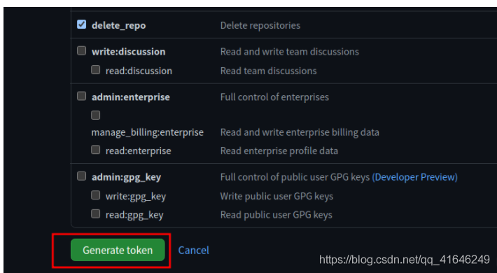

# Github错误信息解决方案

## remote: Support for password authentication was removed on Aug

问题：remote: Support for password authentication was removed on August 13, 2021. Please use a personal access token instead.

大概意思就是`你原先的密码凭证从2021年8月13日`开始就不能用了，`必须使用个人访问令牌（personal access token）`，就是把你的`密码`替换成`token`！

**如何生成自己的token**

登录自己的github账号，个人设置那里

**选择开发者设置 `Developer setting`**

**选择个人访问令牌 `Personal access tokens`，然后选中生成令牌 `Generate new token`**

**设置token的有效期，访问权限等**

选择要授予此`令牌token`的`范围`或`权限`。

- 要使用`token`从命令行访问仓库，请选择`repo`。
- 要使用`token`从命令行删除仓库，请选择`delete_repo`
- 其他根据需要进行勾选

**最后生成令牌 `Generate token`**

**生成后的token如下**

***\*`注意：`\****

记得把你的**token**保存下来，因为你再次刷新网页的时候，你已经没有办法看到它了，所以我还没有彻底搞清楚这个**`token`**的使用，后续还会继续探索！

之后用自己生成的token登录，把上面生成的token粘贴到输入密码的位置，然后成功push代码！

也可以 把token直接添加远程仓库链接中，这样就可以避免同一个仓库每次提交代码都要输入token了：

**git remote set-url origin https://<your_token>@github.com/<USERNAME>/<REPO>.git**

<your_token>：换成你自己得到的token
<USERNAME>：是你自己github的用户名
<REPO>：是你的仓库名称