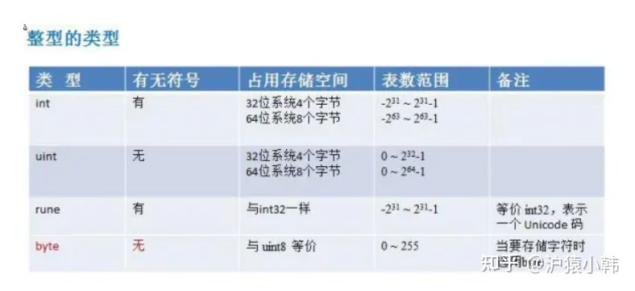
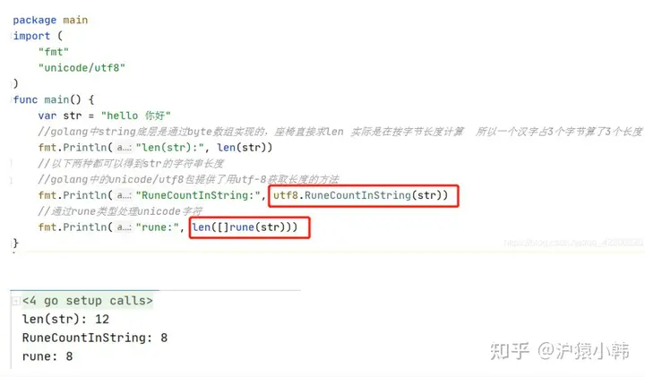
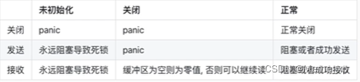

# GO面试题

### **1、golang 中 make 和 new 的区别？（基本必问）**

**共同点：**给变量分配内存

**不同点：**

1）作用变量类型不同，new给string,int和数组分配内存，make给切片，map，channel分配内存；

2）返回类型不一样，new返回指向变量的指针，make返回变量本身；

3）new 分配的空间被清零。make 分配空间后，会进行初始化；

\4) 字节的面试官还说了另外一个区别，就是分配的位置，在堆上还是在栈上？这块我比较模糊，大家可以自己探究下，我搜索出来的答案是golang会弱化分配的位置的概念，因为编译的时候会自动内存逃逸处理，懂的大佬帮忙补充下：make、new内存分配是在堆上还是在栈上？


### **2、数组和切片的区别 （基本必问）**

**相同点：**

1)只能存储一组相同类型的数据结构

2)都是通过下标来访问，并且有容量长度，长度通过 len 获取，容量通过 cap 获取

**区别：**

1）数组是定长，访问和复制不能超过数组定义的长度，否则就会下标越界，切片长度和容量可以自动扩容

2）数组是值类型，切片是引用类型，每个切片都引用了一个底层数组，切片本身不能存储任何数据，都是这底层数组存储数据，所以修改切片的时候修改的是底层数组中的数据。切片一旦扩容，指向一个新的底层数组，内存地址也就随之改变

**简洁的回答：**

1）定义方式不一样 2）初始化方式不一样，数组需要指定大小，大小不改变 3）在函数传递中，数组切片都是值传递。

**数组的定义**

var a1 [3]int

var a2 [...]int{1,2,3}

**切片的定义**

var a1 []int

var a2 :=make([]int,3,5)

**数组的初始化**

a1 := [...]int{1,2,3}

a2 := [5]int{1,2,3}

**切片的初始化**

b:= make([]int,3,5)

### **3、for range 的时候它的地址会发生变化么？**

答：在 for a,b := range c 遍历中， a 和 b 在内存中只会存在一份，即之后每次循环时遍历到的数据都是以值覆盖的方式赋给 a 和 b，a，b 的内存地址始终不变。由于有这个特性，for 循环里面如果开协程，不要直接把 a 或者 b 的地址传给协程。解决办法：在每次循环时，创建一个临时变量。

### **4、go defer，多个 defer 的顺序，defer 在什么时机会修改返回值？**

作用：defer延迟函数，释放资源，收尾工作；如释放锁，关闭文件，关闭链接；捕获panic;

避坑指南：defer函数紧跟在资源打开后面，否则defer可能得不到执行，导致内存泄露。

多个 defer 调用顺序是 LIFO（后入先出），defer后的操作可以理解为压入栈中

defer，return，return value（函数返回值） 执行顺序：首先return，其次return value，最后defer。defer可以修改函数最终返回值，修改时机：**有名返回值或者函数返回指针** 参考：

[【Golang】Go语言defer用法大总结(含return返回机制)__奶酪的博客-CSDN博客](https://link.zhihu.com/?target=https%3A//blog.csdn.net/Cassie_zkq/article/details/108567205)

### **5、uint 类型溢出问题**

超过最大存储值如uint8最大是255

var a uint8 =255

var b uint8 =1

a+b = 0总之类型溢出会出现难以意料的事



### **6、能介绍下 rune 类型吗？**

相当int32

golang中的字符串底层实现是通过byte数组的，中文字符在unicode下占2个字节，在utf-8编码下占3个字节，而golang默认编码正好是utf-8

byte 等同于int8，常用来处理ascii字符

rune 等同于int32,常用来处理unicode或utf-8字符



### **7、 golang 中解析 tag 是怎么实现的？反射原理是什么？(中高级肯定会问，比较难，需要自己多去总结)**

在 Go 中，解析结构体字段的标签是通过反射实现的。反射（reflection）是指在程序运行时动态地检查类型信息和修改对象的能力。在 Go 中，`reflect` 包提供了一组用于进行反射操作的函数和类型。


### **8、调用函数传入结构体时，应该传值还是指针？ （Golang 都是传值）**

在调用函数时，传递结构体的方式可以是传值（pass by value）或传指针（pass by pointer）。

1. 传值：将结构体的副本传递给函数。这意味着在函数内部对结构体的修改不会影响到原始结构体。
2. 传指针：将结构体的地址传递给函数。这样函数内部对结构体的修改会直接影响到原始结构体。


### **9、讲讲 Go 的 slice 底层数据结构和一些特性？**

答：Go 的 slice 底层数据结构是由一个 array 指针指向底层数组，len 表示切片长度，cap 表示切片容量。slice 的主要实现是扩容。对于 append 向 slice 添加元素时，假如 slice 容量够用，则追加新元素进去，slice.len++，返回原来的 slice。当原容量不够，则 slice 先扩容，扩容之后 slice 得到新的 slice，将元素追加进新的 slice，slice.len++，返回新的 slice。对于切片的扩容规则：当切片比较小时（容量小于 1024），则采用较大的扩容倍速进行扩容（新的扩容会是原来的 2 倍），避免频繁扩容，从而减少内存分配的次数和数据拷贝的代价。当切片较大的时（原来的 slice 的容量大于或者等于 1024），采用较小的扩容倍速（新的扩容将扩大大于或者等于原来 1.25 倍），主要避免空间浪费，网上其实很多总结的是 1.25 倍，那是在不考虑内存对齐的情况下，实际上还要考虑内存对齐，扩容是大于或者等于 1.25 倍。

（关于刚才问的 slice 为什么传到函数内可能被修改，如果 slice 在函数内没有出现扩容，函数外和函数内 slice 变量指向是同一个数组，则函数内复制的 slice 变量值出现更改，函数外这个 slice 变量值也会被修改。如果 slice 在函数内出现扩容，则函数内变量的值会新生成一个数组（也就是新的 slice，而函数外的 slice 指向的还是原来的 slice，则函数内的修改不会影响函数外的 slice。）


### **10、讲讲 Go 的 select 底层数据结构和一些特性？（难点，没有项目经常可能说不清，面试一般会问你项目中怎么使用select）**

答：go 的 select 为 golang 提供了多路 IO 复用机制，和其他 IO 复用一样，用于检测是否有读写事件是否 ready。linux 的系统 IO 模型有 select，poll，epoll，go 的 select 和 linux 系统 select 非常相似。

select 结构组成主要是由 case 语句和执行的函数组成 select 实现的多路复用是：每个线程或者进程都先到注册和接受的 channel（装置）注册，然后阻塞，然后只有一个线程在运输，当注册的线程和进程准备好数据后，装置会根据注册的信息得到相应的数据。


**select 的特性**

1）select 操作至少要有一个 case 语句，出现读写 nil 的 channel 该分支会忽略，在 nil 的 channel 上操作则会报错。

2）select 仅支持管道，而且是单协程操作。

3）每个 case 语句仅能处理一个管道，要么读要么写。

4）多个 case 语句的执行顺序是随机的。

5）存在 default 语句，select 将不会阻塞，但是存在 default 会影响性能。

### **11、讲讲 Go 的 defer 底层数据结构和一些特性？**

答：每个 defer 语句都对应一个_defer 实例，多个实例使用指针连接起来形成一个单连表，保存在 gotoutine 数据结构中，每次插入_defer 实例，均插入到链表的头部，函数结束再一次从头部取出，从而形成后进先出的效果。

**defer 的规则总结**：

延迟函数的参数是 defer 语句出现的时候就已经确定了的。

延迟函数执行按照后进先出的顺序执行，即先出现的 defer 最后执行。

延迟函数可能操作主函数的返回值。

申请资源后立即使用 defer 关闭资源是个好习惯。

### **12、单引号，双引号，反引号的区别？**

单引号，表示byte类型或rune类型，对应 uint8和int32类型，默认是 rune 类型。byte用来强调数据是raw data，而不是数字；而rune用来表示Unicode的code point。

双引号，才是字符串，实际上是字符数组。可以用索引号访问某字节，也可以用len()函数来获取字符串所占的字节长度。

反引号，表示字符串字面量，但不支持任何转义序列。字面量 raw literal string 的意思是，你定义时写的啥样，它就啥样，你有换行，它就换行。你写转义字符，它也就展示转义字符。

## **二、map相关**

### 1、map 使用注意的点，是否并发安全？

map的类型是map[key]，key类型的ke必须是可比较的，通常情况，会选择内建的基本类型，比如整数、字符串做key的类型。如果要使用struct作为key，要保证struct对象在逻辑上是不可变的。在Go语言中，map[key]函数返回结果可以是一个值，也可以是两个值。map是无序的，如果我们想要保证遍历map时元素有序，可以使用辅助的数据结构，例如orderedmap。

**第一，**一定要先初始化，否则panic

**第二，**map类型是容易发生并发访问问题的。不注意就容易发生程序运行时并发读写导致的panic。 Go语言内建的map对象不是线程安全的，并发读写的时候运行时会有检查，遇到并发问题就会导致panic。

### 2、map 循环是有序的还是无序的？

无序的, map 因扩张⽽重新哈希时，各键值项存储位置都可能会发生改变，顺序自然也没法保证了，所以官方避免大家依赖顺序，直接打乱处理。就是 for range map 在开始处理循环逻辑的时候，就做了随机播种

### 3、 map的底层实现

golang中map的底层实现主要是哈希表，结构体有两个：hmap和bmap.

```go
type hmap struct {
    count      int            //元素个数，调用len(map)时直接返回
    flags      uint8          //标志map当前状态,正在删除元素、添加元素.....
    B          uint8          //单元(buckets)的对数 B=5表示能容纳32个元素
    noverflow  uint16        //单元(buckets)溢出数量，如果一个单元能存8个key，此时存储了9个，溢出了，就需要再增加一个单元
    hash0      uint32         //哈希种子
    buckets    unsafe.Pointer //指向单元(buckets)数组,大小为2^B，可以为nil
    oldbuckets unsafe.Pointer //扩容的时候，buckets长度会是oldbuckets的两倍
    nevacute   uintptr        //指示扩容进度，小于此buckets迁移完成
    extra      *mapextra      //与gc相关 可选字段
}
buckets：一个指针，指向一个bmap数组、存储多个桶。
oldbuckets： 是一个指针，指向一个bmap数组，存储多个旧桶，用于扩容。
overflow：overflow是一个指针，指向一个元素个数为2的数组，数组的类型是一个指针，指向一个slice，slice的元素是桶(bmap)的地址，这些桶都是溢出桶。为什么有两个？因为Go map在哈希冲突过多时，会发生扩容操作。[0]表示当前使用的溢出桶集合，[1]是在发生扩容时，保存了旧的溢出桶集合。overflow存在的意义在于防止溢出桶被gc。
type bmap struct {
    topbits  [8]uint8
    keys     [8]keytype
    values   [8]valuetype
    pad      uintptr
    overflow uintptr
}
一个桶（bmap）可以存储8个键值对。如果有第9个键值对被分配到该桶，那就需要再创建一个桶，通过overflow指针将两个桶连接起来。在hmap中，多个bmap桶通过overflow指针相连，组成一个链表。
键和值是分开存放的，原因是当key和value类型不一样的时候，key和value占用字节大小不一样，使用key/value这种形式可能会因为内存对齐导致内存空间浪费，所以Go采用key和value分开存储的设计，更节省内存空间
```


哈希表的特点是根据哈希函数求得哈希值，来存储对应的key，golang中根据哈希值将其分为高位和低位；
低8位用于寻找当前key属于哪个hmap中的哪个bucket；而高8位用于确定将其存放在桶中（bucket）的哪个位置；
注意：一个桶内最多有8个位置。这也是为什么map无法使用cap()来求容量的关键原因：map的容量是编译器进行计算后得出的一个结果，由于桶的存在，map在内存中实际存放的大小不一定同make出来后的map的大小一致。

#### 3.1、问：map 中删除一个 key，它的内存会释放么？

通过delete删除map的key，执行gc不会，内存没有被释放，如果通过map=nil，再GC，内存才会释放

#### 3.2、问：nil map 和空 map 有何不同？

nil map是未初始化的map，空map是长度为空

#### 3.3、map并发是否安全？如何保证map的并发安全性？

map默认是并发不安全的，同时对map进行并发读写时，程序会panic

方式一：使用读写锁  map +  sync.RWMutex var lock sync.RWMutex 

方式二：使用Go提供的 sync.Map var map sync.Map

#### 3.4、map的扩容时机

条件一：超过负载

条件二：溢出桶太多

在 Go 中，map 的扩容是由运行时自动处理的，不需要用户手动干预。具体的扩容时机如下：

1. 当 map 中的键值对数量达到当前容量的 7/8（或 87.5%）时，会触发扩容操作。
2. 扩容操作将创建一个更大的哈希表，并重新计算键的哈希值和新的桶位置。
3. 在扩容过程中，会将原有的键值对重新分配到新的哈希表中，因此会涉及一次数据复制的开销。
4. 扩容完成后，新的哈希表取代旧的哈希表，以支持更多的键值对。

### 4、怎么处理对 map 进行并发访问？有没有其他方案？ 区别是什么？

1. 使用互斥锁（Mutex）：

   - 使用 sync 包中的互斥锁可以确保在任何时刻只有一个 goroutine 可以访问 map。
   - 在读取或修改 map 之前获取锁，在操作完成后释放锁。
   - 这种方法可以确保并发访问的安全性，但也会引入一定的性能开销。

2. 使用读写锁（RWMutex）：

   - 使用 sync 包中的读写锁可以允许多个 goroutine 并发地读取 map，但只有一个 goroutine 可以进行写操作。
   - 在读取 map 时获取读锁，在修改 map 时获取写锁。
   - 对于读多写少的场景，使用读写锁可以提高并发性能。

3. 使用通道（Channel）：

   - 将 map 的读写操作封装成函数，并使用通道作为读写请求的队列。
   - 创建一个专门用于执行 map 操作的 goroutine，通过通道接收读写请求，并按顺序处理这些请求。
   - 通过通道实现的串行化访问方式，可以确保并发访问的安全性。

   除了上述方法外，还可以使用 sync 包中其他的同步原语（如原子操作、条件变量等）来处理对 map 的并发访问。此外，还有一种更简单的方案是避免直接对 map 进行并发访问，而是将 map 操作限定在单个 goroutine 中，通过通道或其他数据结构将需要进行并发访问的操作发送给该 goroutine 处理，从而避免了直接的并发访问。

   不同处理方式的区别主要在于实现的复杂性和性能开销。使用互斥锁能够确保并发访问的安全性，但会引入一定的性能开销；使用读写锁可以提高读取性能，但写入仍然需要串行化；使用通道可以避免竞争条件，但可能引入阻塞等待的开销。选择合适的处理方式需根据具体场景和需求进行权衡。

### 5、哪些类型不能作为map的key

**在golang规范中，可比较的类型都可以作为map key；**

**不能作为map key 的类型包括：**

- slices
- maps
- functions

## 三**、context相关**

### **1、context 结构是什么样的？context 使用场景和用途？**

 Go 中，`context` 是一个标准库（`context` 包）中定义的用于传递上下文信息的结构。

`context.Context` 结构是一个接口类型，定义了管理请求的上下文信息的方法，它具有以下主要方法：

- `Deadline()`：返回上下文的截止时间（即取消时间），超过该时间后应该取消上下文。
- `Done()`：返回一个通道，当上下文被取消或超时时，该通道将被关闭。
- `Err()`：返回导致上下文被取消的错误原因。
- `Value(key interface{})`：返回与给定键相关联的值。

`context.Background()` 和 `context.TODO()` 是两个常用的函数，用于创建初始的上下文对象。

`context` 的主要用途是在多个 goroutine 之间传递请求相关的上下文信息，例如取消信号、超时控制、请求跟踪和日志记录等。通过将上下文作为参数传递，在不同的 goroutine 中可以共享相同的上下文，并根据上下文的状态进行相应的操作。

**常见的 `context` 使用场景包括：**

1. 请求传递：将上下文从一个处理器传递到另一个处理器，用于在整个请求处理链中传递请求信息、取消信号以及控制超时。
2. 取消机制：使用上下文来实现取消操作，当需要提前结束某个操作时，可以调用 `context` 的 `cancel()` 方法取消相应的 goroutine。
3. 超时控制：使用上下文和 `context.WithTimeout()` 或 `context.WithDeadline()` 可以设定超时时间，当超过设定时间时自动取消上下文。
4. 请求跟踪和日志记录：可以将请求相关的跟踪 ID、日志记录器等信息存储在上下文中，以便在多个处理器中共享并进行日志记录。

通过使用 `context`，我们可以更好地管理和控制并发操作，提供了一种优雅的方式来处理传递和取消上下文的需求。

### 2、有几种类型的context？

1、**context.Background()**

这个函数返回一个空 context。这只能用于高等级（在 main 或顶级请求处理中）。这能用于派生我们稍后谈及的其他 context 。

2、**context.TODO()**

这个函数也是创建一个空 context。也只能用于高等级或当您不确定使用什么 context，或函数以后会更新以便接收一个 context 。这意味您（或维护者）计划将来要添加 context 到函数。

3、**context.WithValue(parent Context, key, val interface{}) (ctx Context, cancel CancelFunc)**

此函数接收 context 并返回派生 context，其中值 val 与 key 关联，并通过 context 树与 context 一起传递。这意味着一旦获得带有值的 context，从中派生的任何 context 都会获得此值。不建议使用 context 值传递关键参数，而是函数应接收签名中的那些值，使其显式化。

4、**context.WithCancel(parent Context) (ctx Context, cancel CancelFunc)**

这是它开始变得有趣的地方。此函数创建从传入的父 context 派生的新 context。父 context 可以是后台 context 或传递给函数的 context。

返回派生 context 和取消函数。只有创建它的函数才能调用取消函数来取消此 context。如果您愿意，可以传递取消函数，但是，强烈建议不要这样做。这可能导致取消函数的调用者没有意识到取消 context 的下游影响。可能存在源自此的其他 context，这可能导致程序以意外的方式运行。简而言之，永远不要传递取消函数。

5、**context.WithDeadline(parent Context, d time.Time) (ctx Context, cancel CancelFunc)**

此函数返回其父项的派生 context，当截止日期超过或取消函数被调用时，该 context 将被取消。例如，您可以创建一个将在以后的某个时间自动取消的 context，并在子函数中传递它。当因为截止日期耗尽而取消该 context 时，获此 context 的所有函数都会收到通知去停止运行并返回。

```text
ctx, cancel := context.WithDeadline(context.Background(), time.Now().Add(2 * time.Second))
```

6、**context.WithTimeout(parent Context, timeout time.Duration) (ctx Context, cancel CancelFunc)**

此函数类似于 context.WithDeadline。不同之处在于它将持续时间作为参数输入而不是时间对象。此函数返回派生 context，如果调用取消函数或超出超时持续时间，则会取消该派生 context。

```text
ctx, cancel := context.WithTimeout(context.Background(), 2 * time.Second)
```

## **四、channel相关**

### **1、channel 是否线程安全？**

在 Go 中，通道（channel）是线程安全的。可以在多个 goroutine 之间安全地读取和写入通道，而无需额外的锁或同步机制。这是因为 Go 的通道内部实现了同步和互斥机制，确保了并发访问的安全性。

#### 1.1、channel的线程安全是如何实现的？

在 Go 中，通道的线程安全是通过内置的同步机制来实现的。Go 语言的通道使用了以下技术来保证线程安全：

1. 互斥锁（Mutex）：通道中的读取和写入操作都涉及到共享状态的访问，但这些操作是互斥的，只能有一个 goroutine 在任何给定时刻进行读取或写入。因此，通道内部使用互斥锁来确保在同一时间内只有一个 goroutine 能够访问通道的底层数据结构。
2. 条件变量（Condition Variable）：通道的阻塞和解除阻塞操作是通过条件变量来实现的。当一个 goroutine 尝试向满通道发送数据时，它会被阻塞，并且该 goroutine 将会被加入到等待接收数据的队列中。只有当另一个 goroutine 从通道中读取数据或者通道为空时，条件变量才会唤醒被阻塞的 goroutine。
3. 内存屏障（Memory Barrier）：Go 运行时使用内存屏障来确保通道中数据的可见性。内存屏障是一种硬件或软件层面的机制，用于处理多核或多线程环境中的并发访问。在通道中，内存屏障能够保证数据在发送和接收操作之间的一致性，防止出现数据竞争或不一致的问题。

通过这些同步机制的组合，Go 的通道能够提供线程安全的并发访问。无论是发送操作还是接收操作，都会按照先到先服务（FIFO）的顺序进行，并且只有在满足特定条件时才会解除阻塞。这种设计保证了数据的有序性和一致性，避免了常见的并发问题，如数据竞争和死锁。

总结：Go 语言的通道利用互斥锁、条件变量和内存屏障等同步机制来实现线程安全。通过这些机制的协同作用，通道能够保证数据的有序访问和一致性，在多个 goroutine 之间提供安全的并发通信和共享数据的方式。

### 2、channel的底层实现？

**1、缓存区指针（循环数组）**

指向缓存区，缓存区创建channel时指定大小，缓存区满则阻塞写操作

**2、读写等待队列**

用于保存读chan和写chan数据被阻塞的goroutine队列： sendq 和 recvq

**3、读写等待队列索引**

用来记录此循环数组当前发送或接收数据的下标值

**4、互斥锁（Mutex）**

通道中的读取和写入操作都涉及到共享状态的访问，但这些操作是互斥的，只能有一个 goroutine 在任何给定时刻进行读取或写入。因此，通道内部使用互斥锁来确保在同一时间内只有一个 goroutine 能够访问通道的底层数据结构。

### 3、无缓冲channel和有缓冲channel的区别

最大的区别是一个是同步的，一个是非同步的

无缓冲：例如 chan<-1，不仅是向通道放入1，而是要一直等有别的goroutine接收这个参数，那么 chan<-1 才会继续走下去，否则会一直阻塞着。（即如果在一个协程里执行放入取出操作的话会一直阻塞，需要在不同的协程执行）
有缓冲：例如 chan<-1 ，执行后不会阻塞，因为缓冲大小为1；只有当放第二个值且第一个值还没被人拿走，才会阻塞。

### 4、channel有几种模式？

**channel有3种模式**:写操作模式(单向通道)、读操作模式（单向通道)、读写操作模式(双向通道)


### 5、channel有几种状态？

**channel有3种状态**:未初始化、正常、关闭



**注意点:**

1.一个channel不能多次关闭,会导致painc

2.如果多个goroutine都监听同一个channel，那么 channel 上的数据都可能随机被某一个goroutine取走进行消费

3.如果多个goroutine监听同一个channel，如果这个channel被关闭，则所有goroutine都能收到退出信号

### **6、channel的使用场景？**

消息传递、消息过滤，信号广播，事件订阅与广播，请求、响应转发，任务分发，结果汇总，并发控制，限流，同步与异步


## **五、goroutine相关**

### 1、什么是 GMP？（必问）

答：G 代表着 goroutine，P 代表着上下文处理器，M 代表 thread 线程，在 GPM 模型，有一个全局队列（Global Queue）：存放等待运行的 G，还有一个 P 的本地队列：也是存放等待运行的 G，但数量有限，不超过 256 个。GPM 的调度流程从 go func()开始创建一个 goroutine，新建的 goroutine 优先保存在 P 的本地队列中，如果 P 的本地队列已经满了，则会保存到全局队列中。M 会从 P 的队列中取一个可执行状态的 G 来执行，如果 P 的本地队列为空，就会从其他的 MP 组合偷取一个可执行的 G 来执行，当 M 执行某一个 G 时候发生系统调用或者阻塞，M 阻塞，如果这个时候 G 在执行，runtime 会把这个线程 M 从 P 中摘除，然后创建一个新的操作系统线程来服务于这个 P，当 M 系统调用结束时，这个 G 会尝试获取一个空闲的 P 来执行，并放入到这个 P 的本地队列，如果这个线程 M 变成休眠状态，加入到空闲线程中，然后整个 G 就会被放入到全局队列中。

1. G（Goroutine）：Goroutine 是 Go 语言并发模型的基本执行单元。它可以看作是比线程更轻量级的协程，用于并发执行任务。在 Go 程序中，我们可以创建成千上万个 goroutine 来处理并发任务，而每个 goroutine 都会分配一些栈空间供其运行使用。**（简述：Goroutine）**
2. M（Machine）：M 代表了 Go 语言运行时系统中的逻辑处理器或机器。在 Go 程序中，M 负责管理和调度 goroutine 的执行。一个 M 可以绑定到一个操作系统的线程上，也就是 P（Processor）所指的含义。**（简述：线程）**
3. P（Processor）：P 代表了 Go 语言调度器所使用的逻辑处理器。每个 P 都绑定到一个操作系统的线程上，并负责调度和管理一组 goroutine。通过 P，调度器能够在多个 M 上均匀地分配 goroutine 来实现并发执行。**（简述：逻辑处理器）**

#### **1.1、数量问题？**

关于 G,P,M 的个数问题，G 的个数理论上是无限制的，但是受内存限制，P 的数量一般建议是逻辑 CPU 数量的 2 倍，M 的数据默认启动的时候是 10000，内核很难支持这么多线程数，所以整个限制客户忽略，M 一般不做设置，设置好 P，M 一般都是要大于 P。

### 2、进程、线程、协程有什么区别？（必问）

进程：是应用程序的启动实例，每个进程都有独立的内存空间，不同的进程通过进程间的通信方式来通信。

线程：从属于进程，每个进程至少包含一个线程，线程是 CPU 调度的基本单位，多个线程之间可以共享进程的资源并通过共享内存等线程间的通信方式来通信。

协程：为轻量级线程，与线程相比，协程不受操作系统的调度，协程的调度器由用户应用程序提供，协程调度器按照调度策略把协程调度到线程中运行

### **3、抢占式调度是如何抢占的？**

**1、基于协作式抢占**

**2、基于信号量抢占**

就像操作系统要负责线程的调度一样，Go的runtime要负责goroutine的调度。现代操作系统调度线程都是抢占式的，我们不能依赖用户代码主动让出CPU，或者因为IO、锁等待而让出，这样会造成调度的不公平。基于经典的时间片算法，当线程的时间片用完之后，会被时钟中断给打断，调度器会将当前线程的执行上下文进行保存，然后恢复下一个线程的上下文，分配新的时间片令其开始执行。这种抢占对于线程本身是无感知的，系统底层支持，不需要开发人员特殊处理。

基于时间片的抢占式调度有个明显的优点，能够避免CPU资源持续被少数线程占用，从而使其他线程长时间处于饥饿状态。goroutine的调度器也用到了时间片算法，但是和操作系统的线程调度还是有些区别的，因为整个Go程序都是运行在用户态的，所以不能像操作系统那样利用时钟中断来打断运行中的goroutine。也得益于完全在用户态实现，goroutine的调度切换更加轻量。

### 4、怎么控制并发数？

控制并发数是指限制同时执行的并发操作数量，可以通过以下几种方式进行控制：

1. 信号量（Semaphore）：信号量是一种计数器，用于记录可用的资源数量。你可以创建一个具有指定数量的信号量，并在并发操作开始之前获取信号量，执行完毕后释放信号量。通过控制信号量的数量，可以限制并发操作的数量。
2. 互斥锁（Mutex）：互斥锁是一种同步原语，它可以用于限制同时只有一个 goroutine 可以进入临界区。通过在并发操作的开头使用互斥锁进行加锁，保证同一时间只有一个操作可以执行，从而实现对并发数的控制。
3. WaitGroup：WaitGroup 是 Go 语言提供的一种等待机制，它可以用于等待一组并发操作完成。你可以使用 Add 方法增加等待的数量，每个并发操作执行完毕后使用 Done 方法减少等待数量，最后通过 Wait 方法阻塞主线程，直到所有并发操作完成。
4. Channel：通过使用带缓冲区的通道，可以在进行并发操作时进行控制。你可以创建一个带有限定容量的通道，并在执行并发操作之前往通道发送值。通道的容量限制了同时进行并发操作的数量，当通道已满时，其他并发操作会被阻塞。
5. 并发安全的数据结构：某些并发安全的数据结构（如 sync.Map）或库（如限制并发访问的连接池）内部实现了对并发数的控制。通过使用这些数据结构或库，你可以间接地控制对共享资源的并发访问数量。

## 六、锁相关

### 1、除了 mutex 以外还有那些方式安全读写共享变量？

除了使用互斥锁（mutex）之外，还有以下几种方式可以安全地进行读写共享变量：

1. 原子操作（atomic operations）：Go 语言的 `sync/atomic` 包提供了一组原子操作函数，如 `AddInt64`、`LoadUint32`、`StorePointer` 等。使用原子操作可以直接对共享变量进行原子增减、加载和存储等操作，避免了互斥锁的开销。
2. 读写锁（read-write lock）：在读多写少的场景下，可以使用读写锁来提高并发性能。Go 语言的 `sync.RWMutex` 类型提供了读写锁的功能。读锁可以同时被多个 goroutine 获取，但写锁只能被一个 goroutine 获取。读写锁适用于多个 goroutine 同时读取共享变量的情况，读操作之间不会产生竞争，从而提高并发性能。
3. 通道（channel）：通过使用带缓冲区的通道，可以在进行读写操作时进行同步。通过将共享变量放入通道中进行传递，可以确保每次只有一个 goroutine 在读写该变量。这种方式可以避免数据竞争和锁的使用，但仅适用于需要传递值的场景。
4. 原子比较交换（compare-and-swap）：原子比较交换操作是一种乐观锁机制，通过比较共享变量的当前值和期望值是否相等，并在相等的情况下进行修改，可以实现对变量的原子更新。Go 语言的 `sync/atomic` 包提供了相关的原子比较交换函数，如 `CompareAndSwapInt32`、`CompareAndSwapPointer` 等。
5. 写时复制（copy-on-write）：写时复制是一种在并发情况下处理共享变量的策略。当一个 goroutine 需要修改共享变量时，会先创建该变量的副本，并在副本上进行修改，而不是直接修改原始变量。这样可以避免多个 goroutine 之间的竞争，提高并发性能。写时复制通常用于不经常修改但频繁读取的大型数据结构，如字典、列表等。

#### **1.1、原子操作与互斥锁的区别**

原子操作（atomic operations）和互斥锁（mutex）是并发编程中常用的两种保证对共享变量安全访问的机制，它们有以下几点不同之处：

1. 机制：原子操作是一种底层的硬件级别的指令，用于在单个操作中完成对共享变量的读取、修改和存储，保证这个操作是不可分割的。而互斥锁是一种高级的同步原语，通过对共享资源进行加锁和解锁，控制多个 goroutine 对共享变量的访问顺序，确保一次只有一个 goroutine 可以访问。
2. 开销：原子操作通常比互斥锁的开销更小。在原子操作中，不需要进行上下文的切换或者系统调用，因此可以获得更好的性能。而互斥锁会涉及到线程的切换、上下文的保存和恢复等额外开销，因此在频繁竞争的情况下可能会导致较大的性能损失。
3. 功能：原子操作只能完成基本的读取和修改操作，如增减、加载和存储等。而互斥锁提供了更灵活的功能，可以支持任意代码段的临界区保护，即一次只允许一个 goroutine 进入临界区。
4. 使用场景：原子操作适用于对单个共享变量的简单操作，如计数器的自增/自减。而互斥锁适用于对复杂数据结构或临界区的保护，可以确保在临界区中的操作是原子的。

## **七、GC相关**

### 1、go gc 是怎么实现的？（必问）

Go 语言的垃圾回收（Garbage Collection，简称 GC）是通过自动内存管理实现的。Go 的 GC 实现基于三色标记清除算法（Tricolor Mark and Sweep Algorithm）和写屏障技术（Write Barrier），下面是大致的工作流程：

1. 标记阶段（Marking Phase）：GC 首先从根对象（如全局变量、栈上的引用等）开始，通过追踪可达性，将所有活跃的对象标记为存活对象。在标记过程中使用了三个颜色标记法：白色（未访问）、灰色（已访问但未递归处理子对象）、黑色（已访问且已递归处理子对象）。
2. 写屏障（Write Barrier）：Go 的 GC 引入了写屏障技术来追踪对指针的修改。当程序中的代码对指针进行写操作时，会触发写屏障，将被修改对象标记为灰色，以确保这个对象及其子对象在标记阶段能够被正确追踪到。
3. 清除阶段（Sweeping Phase）：在标记阶段完成后，GC 将扫描整个堆，回收所有未被标记的对象。这些未被标记的对象被认为是不可达的，并且可以被安全地释放内存。
4. 内存整理（Memory Compaction）：GC 在清除阶段之后可能还会进行内存整理操作，将存活对象的内存整理到一起，以减少内存碎片化。内存整理过程可能涉及对对象的移动和调整引用关系。

### 2、GC 中 stw 时机，各个阶段是如何解决的？

在 Go 的垃圾回收（Garbage Collection，简称 GC）过程中，STW（Stop-The-World）指的是暂停程序的执行，以便进行垃圾回收操作。然而，在 Go 1.13 及之后的版本中，GC 的 STW 时间已经被显著降低，并且只会在必要的情况下才被触发。

下面是各个阶段中如何解决 STW 的问题：

1. 标记阶段（Marking Phase）：标记阶段是并发执行的，不会导致长时间的 STW。Go 在标记阶段中使用 write barrier 技术，通过跟踪对指针的写操作，确保可达对象被正确地标记为活跃对象，并且可以同时进行程序的执行。这种并发标记的方式减少了 STW 的时间和影响。
2. 根扫描（Root Scanning）：GC 使用 write barrier 追踪对根对象的修改，并且并发进行根扫描操作，以识别程序的根对象。这样可以在减少 STW 时间的同时，确保所有的根对象被检测到。
3. 存活对象寻找（Finding Live Objects）：在并发标记完成后，GC 需要进行额外的工作来找到所有存活的对象。这个过程也是并发执行的，与程序的执行同时进行。GC 使用了并发算法来在不停顿程序的情况下找到存活对象，以减少 STW 时间。
4. 清除阶段（Sweeping Phase）：在并发标记和存活对象寻找完成后，GC 进入清除阶段。清除阶段也是并发执行的，GC 会扫描整个堆，回收所有未标记的对象，并释放它们占用的内存空间。这个过程也不会导致 STW。

需要注意的是，尽管 Go 的 GC 实现采取了并发的策略来减少 STW 时间，但在某些情况下，仍然可能会发生短暂的 STW，例如在堆增长时或者进行某些特定的 GC 操作时。但是，在大多数情况下，GC 的 STW 时间已经大大减少，并且对程序的执行影响较小。

### 3、GC 的触发时机？

**系统触发**

1）gcTriggerHeap：当所分配的堆大小达到阈值（由控制器计算的触发堆的大小）时，将会触发。

2）gcTriggerTime：当距离上一个 GC 周期的时间超过一定时间时，将会触发。时间周期以runtime.forcegcperiod 变量为准，默认 2 分钟。

3）gcTriggerCycle：如果没有开启 GC，则启动 GC。

**主动触发**

1）手动触发的 runtime.GC 方法。


## **八、内存相关**

### 1、什么情况下内存会泄露？怎么定位排查内存泄漏问题？

答：go 中的内存泄漏一般都是 goroutine 泄漏，就是 goroutine 没有被关闭，或者没有添加超时控制，让 goroutine 一只处于阻塞状态，不能被 GC。

**内存泄露有下面一些情况**

1）如果 goroutine 在执行时被阻塞而无法退出，就会导致 goroutine 的内存泄漏，一个 goroutine 的最低栈大小为 2KB，在高并发的场景下，对内存的消耗也是非常恐怖的。

2）互斥锁未释放或者造成死锁会造成内存泄漏

3）time.Ticker 是每隔指定的时间就会向通道内写数据。作为循环触发器，必须调用 stop 方法才会停止，从而被 GC 掉，否则会一直占用内存空间。

4）字符串的截取引发临时性的内存泄漏

5）切片截取引起子切片内存泄漏

6）函数数组传参引发内存泄漏【如果我们在函数传参的时候用到了数组传参，且这个数组够大（我们假设数组大小为 100 万，64 位机上消耗的内存约为 800w 字节，即 8MB 内存），或者该函数短时间内被调用 N 次，那么可想而知，会消耗大量内存，对性能产生极大的影响，如果短时间内分配大量内存，而又来不及 GC，那么就会产生临时性的内存泄漏，对于高并发场景相当可怕。

**排查方式：**

1、可以使用 pprof 包和相关的命令行工具来收集和分析程序的内存使用情况。

2、内存监控和日志记录：通过记录程序的内存使用情况和相关日志信息，可以帮助定位内存泄漏的位置。例如，记录内存分配和释放的次数、缓存大小的变化等。

3、单元测试和压力测试：编写相应的单元测试和压力测试来模拟不同场景下的内存使用情况，并观察内存是否正常释放。


### 2、知道 golang 的内存逃逸吗？什么情况下会发生内存逃逸？（必问）

答：1)本该分配到栈上的变量，跑到了堆上，这就导致了内存逃逸。2)栈是高地址到低地址，栈上的变量，函数结束后变量会跟着回收掉，不会有额外性能的开销。3)变量从栈逃逸到堆上，如果要回收掉，需要进行 gc，那么 gc 一定会带来额外的性能开销。编程语言不断优化 gc 算法，主要目的都是为了减少 gc 带来的额外性能开销，变量一旦逃逸会导致性能开销变大。

**内存逃逸的情况如下：**

1）方法内返回局部变量指针。

2）向 channel 发送指针数据。

3）在闭包中引用包外的值。

4）在 slice 或 map 中存储指针。

5）切片（扩容后）长度太大。

6）在 interface 类型上调用方法。

### 3、请简述 Go 是如何分配内存的？


1. 栈（Stack）：栈是用于管理函数调用和局部变量的一种数据结构。每当一个函数被调用时，栈会为该函数分配一块内存空间，其中包含函数的参数、返回值以及局部变量等。当函数执行完毕后，栈会自动释放该内存空间。栈的分配和释放都是非常快速的，因此适合用于存储较小且生命周期短暂的对象。
2. 堆（Heap）：堆是用于动态分配内存的区域，存储对象的生命周期比栈更长。在堆上分配的内存需要手动释放，否则就会发生内存泄漏。Go 语言的垃圾回收机制（Garbage Collection）负责自动管理堆上的内存。通过使用算法（例如标记-清除算法），垃圾回收器能够识别不再需要的对象，并释放其占用的内存空间。Go 的垃圾回收器会根据堆的大小和对象的分配情况来自动触发垃圾回收。
3. 内存分配器（Memory Allocator）：Go 语言有自己的内存分配器，负责从堆上分配对象所需的内存空间。Go 的内存分配器使用了多个 goroutine（轻量级线程）来同时分配内存，以提高分配效率。内存分配器还会根据对象的大小选择不同的分配策略，例如小对象直接在堆上分配，而大对象则使用指针引用。此外，内存分配器还会重复使用已经释放的内存空间，以减少系统调用的开销。

#### 3.1、mcache mcentral mheap mspan（细化）

1. mcache（memory cache）：mcache 是每个线程（goroutine）私有的缓存，用于高效地分配小对象。它存储了已分配但尚未释放的小对象，以减少对堆的频繁访问。mcache 的大小是固定的，并且它包含了多个用于存储对象的 mspan。
2. mcentral（memory central）：mcentral 是全局的、线程共享的数据结构，用于管理 mcache。每个 mcentral 负责一定范围内对象的分配和回收。当 mcache 中的 mspan 不足时，mcentral 会为其分配新的 mspan，并负责将 mspan 进行回收。
3. mheap（memory heap）：mheap 是全局的、线程共享的数据结构，表示堆。堆是用于存储动态分配的对象的区域。mheap 维护了堆的元数据，包括堆的起始地址、大小以及空闲块的链表等。mheap 提供了分配和释放内存的接口。
4. mspan（memory span）：mspan 是另一个重要的数据结构，用于管理堆上的一块连续的内存区域。每个 mspan 对应一种大小的对象，并维护着相关的元数据，如分配的对象数量、空闲的对象等。mspan 还保存了指向 mcache 和 mcentral 的指针，以便在需要时进行内存分配和回收。

### 4、Channel 分配在栈上还是堆上？哪些对象分配在堆上，哪些对象分配在栈上？

Channel 是分配在堆上的。Channel 是一种引用类型，它内部包含了一些管理和同步通信的数据结构

1. **栈上分配**：栈上主要用于存储局部变量和函数调用相关的数据。这些对象的生命周期是短暂的，随着函数的执行结束，它们会自动释放。栈上的对象分配和释放都非常快速，不需要垃圾回收。
2. **堆上分配**：堆上主要用于存储动态分配的对象，这些对象的生命周期较长或者大小不确定。Go 的垃圾回收器负责管理堆上的内存。以下是一些在堆上分配的对象：
   - 使用 `new()` 或 `make()` 创建的对象，如 `new(T)` 或 `make([]T, length)`。
   - 通过 `return` 语句返回的指针或引用类型对象。
   - 被闭包（closure）引用的变量，因为闭包可能在函数执行完毕后仍然存在。

### 5、介绍一下大对象小对象，为什么小对象多了会造成 gc 压力？

小于等于 32k 的对象就是小对象，其它都是大对象。一般小对象通过 mspan 分配内存；大对象则直接由 mheap 分配内存。通常小对象过多会导致 GC 三色法消耗过多的 CPU。优化思路是，减少对象分配。

**小对象**：如果申请小对象时，发现当前内存空间不存在空闲跨度时，将会需要调用 nextFree 方法获取新的可用的对象，可能会触发 GC 行为。

**大对象**：如果申请大于 32k 以上的大对象时，可能会触发 GC 行为。


## 九、go-zero相关

## 十、gRPC相关

### 1、什么是gRPC

gRPC是一种高性能、开源的远程过程调用 (RPC) 框架，由Google开发，它建立在HTTP/2（基于传输层安全性协议，TLS）上，并使用Protocol Buffers（简称ProtoBuf）作为接口定义语言。

**特点：**

1. 高性能：采用基于二进制的协议格式，通过HTTP/2提供多路复用、流量控制和头部压缩等功能，从而降低网络和处理开销。
2. 跨平台和跨语言：支持多种编程语言，使得不同系统之间可以方便地进行通信。
3. 支持多种序列化格式：默认使用ProtoBuf作为序列化格式，但也可以选择使用其他序列化格式，如JSON。
4. 提供流式处理能力：可以在单个连接上实现双向流式通信，从而支持服务器端流、客户端流和双向流。
5. 支持拦截器和中间件：可以对请求、响应进行拦截和处理，方便实现认证、日志记录等功能。

2、

## 十一、其他问题

### 1、Go 多返回值怎么实现的？

答：Go 传参和返回值是通过 FP+offset 实现，并且存储在调用函数的栈帧中。FP 栈底寄存器，指向一个函数栈的顶部;PC 程序计数器，指向下一条执行指令;SB 指向静态数据的基指针，全局符号;SP 栈顶寄存器。

### 2、讲讲 Go 中主协程如何等待其余协程退出?

答：Go 的 sync.WaitGroup 是等待一组协程结束，sync.WaitGroup 只有 3 个方法，Add()是添加计数，Done()减去一个计数，Wait()阻塞直到所有的任务完成。Go 里面还能通过有缓冲的 channel 实现其阻塞等待一组协程结束，这个不能保证一组 goroutine 按照顺序执行，可以并发执行协程。Go 里面能通过无缓冲的 channel 实现其阻塞等待一组协程结束，这个能保证一组 goroutine 按照顺序执行，但是不能并发执行。

**啰嗦一句：**循环智能二面，手写代码部分时，三个协程按交替顺序打印数字，最后题目做出来了，问我代码中Add()是什么意思，我回答的不是很清晰，这家公司就没有然后了。Add()表示协程计数，可以一次Add多个，如Add(3),可以多次Add(1);然后每个子协程必须调用done（）,这样才能保证所有子协程结束，主协程才能结束。

### 3、Go 语言中不同的类型如何比较是否相等？

答：像 string，int，float interface 等可以通过 reflect.DeepEqual 和等于号进行比较，像 slice，struct，map 则一般使用 reflect.DeepEqual 来检测是否相等。

### 4、Go 中 init 函数的特征?

答：一个包下可以有多个 init 函数，每个文件也可以有多个 init 函数。多个 init 函数按照它们的文件名顺序逐个初始化。应用初始化时初始化工作的顺序是，从被导入的最深层包开始进行初始化，层层递出最后到 main 包。不管包被导入多少次，包内的 init 函数只会执行一次。应用初始化时初始化工作的顺序是，从被导入的最深层包开始进行初始化，层层递出最后到 main 包。但包级别变量的初始化先于包内 init 函数的执行。

### 5、Go 中 uintptr 和 unsafe.Pointer 的区别？

答：unsafe.Pointer 是通用指针类型，它不能参与计算，任何类型的指针都可以转化成 unsafe.Pointer，unsafe.Pointer 可以转化成任何类型的指针，uintptr 可以转换为 unsafe.Pointer，unsafe.Pointer 可以转换为 uintptr。uintptr 是指针运算的工具，但是它不能持有指针对象（意思就是它跟指针对象不能互相转换），unsafe.Pointer 是指针对象进行运算（也就是 uintptr）的桥梁。

