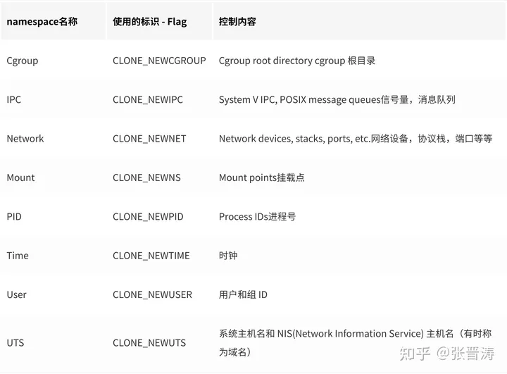

# http基础面试题

## 1、get和post请求的区别

1.GET请求在浏览器刷新或者回退的时候是没危险的。POST的话数据会被重新提交。

2.长度限制：当发送请求时，GET请求一般是向URL添加参数数据，URL的最大长度是2048个字符；

POST请求一般参数不在请求URL中，而在body中。

3.GET可以被书签收藏，POST不行

4.GET可以存在缓存中，POST不行

5.GET会将数据存在浏览器的历史中，POST不会

6.GET 编码格式只能用ASCII码，POST没有限制

7.GET 数据类型application/x-www-form-urlencoded,POST是application/x-www-form-urlencoded或者multipart/form-data。

8.GET 和POST在请求的时候：

GET 是将数据中的hearder 和 data 一起发送给服务端，返回200code

POST 是先将hearder发给服务器返回100continue，再发送data给到服务器，返回200

9.GET 就发送了一个TCP数据包给服务器，POST发送了两次TCP数据包给服务器。

## 2、HTTP 和 HTTPS 的区别？

1. 安全性：HTTP是明文传输数据的协议，数据在传输过程中不加密，容易被窃听和篡改。而HTTPS通过使用SSL/TLS协议进行加密，确保数据在传输过程中的安全性和完整性。
2. 默认端口：HTTP使用默认端口80进行通信，而HTTPS使用默认端口443进行通信。
3. 连接方式：HTTP使用无状态的连接方式，即每次请求与响应之间没有持久的连接。而HTTPS可以使用持久连接，提供更好的性能。
4. 证书：HTTPS使用证书来验证服务器的身份，并建立安全连接。服务器需要获得可信的数字证书，而HTTP没有类似的证书验证机制。
5. URL前缀：HTTP的URL以"http://"开头，而HTTPS的URL以"https://"开头。
6. 加密算法：HTTPS使用SSL/TLS协议进行数据加密，支持多种加密算法，如RSA、AES等。而HTTP没有加密处理。
7. 性能：由于HTTPS需要进行加密和解密操作，相比HTTP而言，会带来一定的性能开销。HTTPS比起HTTP会消耗更多的计算资源和网络带宽。

### 2.1、什么是http？什么是https？

http协议是超文本传输协议，通常用于web浏览器和web服务器传输数据，HTTP协议以明文方式发送内容，不提供任何方式的数据加密

https协议是超文本安全传输协议，通常是基于http + ssl/tls来实现，它使用公钥加密来确保客户端和服务器之间的通信不被窃听或篡改，

客户端和服务器之间进行握手过程，交换加密密钥，确保加密通道的建立。

## 3、三次握手和四次挥手

1. **三次握手：** 

   a. 第一步：客户端发送一个SYN标志的TCP请求包（SYN包）给服务器，表示请求建立连接，并随机选择一个初始序列号。 

   b. 第二步：服务器接收到客户端的SYN包后，回复一个ACK标志的TCP响应包（ACK包），表示同意建立连接，同时也发送一个SYN标志的包（SYN-ACK包）给客户端，确认请求，并选择自己的初始序列号。 

   c. 第三步：客户端接收到服务器的SYN-ACK包后，发送一个ACK标志的包给服务器，表示确认连接的建立。服务器收到这个ACK包后，完成连接的建立。

2. **四次挥手：** 

   a. 第一步：客户端发送一个FIN标志的TCP包（FIN包）给服务器，表示要关闭连接。 

   b. 第二步：服务器收到客户端的FIN包后，发送一个ACK标志的包给客户端，表示已经收到关闭请求。 

   c. 第三步：服务器发送一个FIN标志的包给客户端，表示要关闭连接。 

   d. 第四步：客户端收到服务器的FIN包后，发送一个ACK标志的包给服务器，表示确认收到关闭请求。服务器收到这个ACK包后，完成连接的关闭。

## 4、TCP与UDP区别

TCP（Transmission Control Protocol）和UDP（User Datagram Protocol）是网络通信中两种常用的传输协议，它们之间的主要区别如下：

1. 连接性：TCP是一种面向连接的协议，通过三次握手建立可靠的连接，确保数据传输的可靠性。UDP是无连接的协议，不需要事先建立连接，发送数据时也不会收到对方是否接收成功的确认。
2. 可靠性：TCP提供可靠的数据传输，通过序号、确认和重传机制来保证数据的完整性和正确性。UDP不提供可靠性保证，发送的数据包可能丢失、重复或者乱序。
3. 传输效率：由于TCP保证了可靠性，所以在传输过程中会有较多的额外开销，如序号管理、确认机制、重传等，因此在传输效率上相对较低。而UDP没有这些额外开销，传输效率较高。
4. 数据包大小：TCP可以处理任意大小的数据，将较大的数据拆分成适合网络传输的小数据段进行传输。UDP每个数据包的大小限制在64KB内。
5. 顺序保证：TCP能够保证数据包按照发送的顺序进行接收和传送，而UDP不能保证数据包的顺序性。
6. 适用场景：TCP适用于对数据可靠性要求较高的应用，如文件传输、电子邮件等。UDP适用于实时性要求较高的应用，如实时视频、音频通信等。

**TCP提供可靠的连接和数据传输，适用于对数据可靠性要求较高的应用场景；UDP是一种简单、快速的传输协议，适用于实时性要求较高的应用场景。选择使用TCP还是UDP需要根据具体的应用需求来决定。**

### 4.1、什么是TCP？什么是UDP？

**TCP**：TCP是一种面向连接的协议，它提供可靠的、有序的、基于字节流的数据传输。它通过三次握手建立连接，在发送方和接收方之间创建一个虚拟的连接通道。TCP协议保证数据的可靠性，它使用流量控制、拥塞控制和错误校验等机制来确保数据的正确到达。TCP适用于对数据准确性和顺序性要求较高的应用，例如文件传输、电子邮件、网页浏览等。

**UDP**：UDP是一种无连接的协议，它提供不可靠的、无序的数据传输。UDP不需要事先建立连接，数据包可以直接从发送方发送到接收方。UDP协议不提供像TCP那样的可靠性保证，因此数据包可能会丢失、重复、乱序。UDP适用于实时性要求高的应用，例如音频流、视频流、在线游戏等，因为它更加轻量级，延迟较低。

### 4.2、如何让UDP变得可靠？

- 一个是重传机制，丢包需要进行重传，可以用ACK也可以用NACK的方式；
- 第二是重排机制，我们在收到乱序数据一定需要增加一个缓冲区进行数据重排；
- 第三是超时机制，长时间没收收到对方的回复需要进行重试；
- 第四，流量控制，在局域网内一般是不考虑这部分，实现起来比较复杂，收益不是那么大。

## 5、TCP协议怎么保证传输可靠性，如果收到了重复数据怎么办？

TCP（传输控制协议）通过以下机制来保证传输的可靠性：

1. 序列号和确认应答：每个 TCP 数据包都有一个唯一的序列号，用于指示数据在传输中的顺序。接收方会发送确认应答（ACK）来确认已经成功接收到的数据，并告知发送方下一次期望接收的数据的序列号。
2. 超时重传：发送方会设置一个定时器，在发送数据后等待一段时间，如果在超时时间内未收到对应的 ACK 确认，发送方会重新发送该数据。
3. 滑动窗口：TCP 使用滑动窗口机制来控制发送方发送数据的速率。接收方会告知发送方它的接收窗口大小，发送方根据接收窗口的大小进行发送，确保不会发送过多的数据，避免接收方无法处理。
4. 丢失数据的检测和重传：如果接收方发现收到的数据包有缺失，它会发送一个特殊的 ACK，告知发送方需要重传缺失的数据。

当收到重复的数据时，TCP 会采取以下操作：

1. 接收方会检测到接收到了重复的数据，但不会将其交给上层应用程序。它会正常发送一个 ACK 确认，通知发送方已经接收到了这些重复数据。
2. 发送方在收到 ACK 确认后，发现这个 ACK 确认的序列号大于当前未被确认的最大序列号，说明之前发送的数据包中有丢失的部分。发送方会根据收到的 ACK 确认来进行重传，确保丢失的数据能够被接收方正确接收。

通过以上的机制，TCP 可以有效地保证传输的可靠性，并能够应对重复数据的情况。

## 6、浏览器输入网址以后都做了哪些动作？

1. URL 解析：浏览器会解析输入的网址（URL），提取出协议（如HTTP、HTTPS）、主机名（域名）、端口号、路径、查询参数等信息。
2. DNS 解析：浏览器将主机名转换为对应的 IP 地址。它会向本地 DNS 缓存查询，如果没有缓存则会发起 DNS 查询请求到 DNS 服务器，并获取到对应的 IP 地址。
3. 建立网络连接：浏览器通过 TCP/IP 协议与目标服务器建立网络连接。它会使用获取到的 IP 地址和端口号建立 socket 连接。
4. 发起 HTTP 请求：浏览器向目标服务器发送 HTTP 请求。请求中包含方法（GET、POST等）、路径、头部信息、请求体（例如表单数据或请求的内容）等。
5. 接收响应：目标服务器收到请求后，会根据请求进行处理，并生成相应的 HTTP 响应。服务器将响应报文发送回浏览器。
6. 处理响应：浏览器接收到服务器的响应后，会根据响应的状态码（如200、404等）来判断请求是否成功。同时，浏览器会解析响应报文中的头部信息和响应体，以获取所需的数据。

## **7、如何实现tcp的流量控制？**

TCP（传输控制协议）使用了一种称为滑动窗口的机制来实现流量控制。滑动窗口的目的是确保发送方不会发送过多的数据，以使接收方能够处理和接收这些数据。

以下是 TCP 流量控制的基本原理：

1. 窗口大小（Window Size）：TCP 在连接建立时使用窗口大小进行初始化，表示接收方在没有确认之前可以接收的最大数据量。窗口大小是一个动态的值，接收方可以通过 TCP 协议中的窗口更新信息告知发送方窗口大小的变化。
2. 滑动窗口机制：发送方根据接收方返回的窗口大小信息来决定发送的数据量。发送方发送的数据不能超过接收方的窗口大小，以确保接收方有足够的缓冲区来接收和处理数据。
3. 窗口滑动：接收方将已成功接收并处理的数据确认返回给发送方。发送方根据接收到的确认信息，移动发送窗口的起始位置，允许发送更多的数据。这样，发送方可以根据接收方的处理能力进行调整，避免发送过多的数据导致接收方溢出或拥塞。

## 8、http协议的缓存策略有哪些？

#### **得分点**

​    强制缓存、协商缓存

#### **参考答案**

**标准回答**

​    HTTP协议的缓存策略有两种，分别是强制缓存和协商缓存，强制缓存的优先级大于协商缓存。强制缓存是服务器告诉浏览器一个缓存时间，在缓存时间内，下次请求，直接用缓存，不在时间内，执行协商缓存策略。协商缓存是让客户端与服务器之间能实现缓存文件是否更新的验证、提升缓存的复用率，将缓存信息中的Etag和Last-Modified字段通过请求发送给服务器，由服务器校验。如果文件没有改变，那么直接返回304状态，继续使用浏览器缓存。

**加分回答**

​    HTTP协议的缓存策略是浏览器每次发起请求时，先在本地缓存中查找结果以及缓存标识，根据缓存标识来判断是否使用本地缓存。如果缓存有效，则使用本地缓存，否则，则向服务器发起请求并携带缓存标识。HTTP协议的缓存策略分两种：强制缓存和协商缓存，而强制缓存优先级大于协商缓存。

- 强制缓存：服务器告诉浏览器一个缓存时间，在缓存时间内，下次请求，直接用缓存，不在时间内，执行比较缓存策略。 
- 协商缓存：让客户端与服务器之间能实现缓存文件是否更新的验证、提升缓存的复用率，将缓存信息中的Etag和Last-Modified
  通过请求发送给服务器，由服务器校验。如果文件没有改变，那么直接返回304状态，继续使用浏览器缓存。 

HTTP缓存都是从第二次请求开始的：

- 第一次请求资源时，服务器返回资源，并在响应头首部中回传资源的缓存策略。 
- 第二次请求时，浏览器判断这些请求参数，击中强缓存就直接返回状态码200，否则就把请求参数加到请求头首部中传给服务器，看是否击中协商缓存，击中则返回304，否则服务器会返回新的资源。 

#### **延伸阅读**

强制缓存：

- 强缓存命中则直接读取浏览器本地的资源，在network中显示的是from memory或者from disk。 
- 控制强制缓存的字段有：Cache-Control（http1.1）和Expires（http1.0）。 
- Cache-control是一个相对时间，用以表达自上次请求正确的资源之后的多少秒的时间段内缓存有效。 
- Expires是一个绝对时间。用以表达在这个时间点之前发起请求可以直接从浏览器中读取数据，而无需发起请求。 
- Cache-Control的优先级比Expires的优先级高。前者的出现是为了解决Expires在浏览器时间被手动更改导致缓存判断错误的问题。如果同时存在则使用Cache-control。 

协商缓存：

- 协商缓存的状态码由服务器决策返回200或者304 
- 当浏览器的强缓存失效的时候或者请求头中设置了不走强缓存，并且在请求头中设置了If-Modified-Since或者 If-None-Match的时候，会将这两个属性值到服务端去验证是否命中协商缓存，如果命中了协商缓存，会返回 304 状态，加载浏览器缓存，并且响应头会设置 Last-Modified或者ETag属性。 
- 对比缓存在请求数上和没有缓存是一致的，但如果是 304 的话，返回的仅仅是一个状态码而已，并没有实际的文件内容，因此在响应体体积上的节省是它的优化点。 
- 协商缓存有2组字段(不是两个)，控制协商缓存的字段有：Last-Modified/If-Modified-since（http1.0）和Etag/If-None-match（http1.1）。 
- Last-Modified/If-Modified-since表示的是服务器的资源最后一次修改的时间。Etag/If-None-match表示的是服务器资源的唯一标识，只要资源变化，Etag就会重新生成。 
- Etag/If-None-match的优先级比Last-Modified/If-Modified-since高。

## 9、IP协议的首部结构 

第一个4字节： 版本号；首部长度； 服务类型；总长度；

第二个4字节：标识；标志；片偏移；

第三个4字节：生存时间；协议；校验和；

第四个4字节：源ip地址；

第五个4字节：目的ip地址；

## 10、什么是session，什么是cookie？他们的区别是什么

在网络应用程序中，Session 和 Cookie 是常见的用于跟踪用户状态和存储用户数据的机制。

**Session**：

- Session 是服务器端存储用户数据的一种机制。它通过在服务器上创建一个唯一的会话标识符（Session ID）来跟踪用户的会话状态。
- 当用户首次访问服务器时，服务器会为该用户创建一个唯一的 Session ID，并将该 ID 存储在服务器端。然后，将该 Session ID 发送给客户端，并且通常以 Cookie 的形式存储在客户端。
- 用户再次访问服务器时，会携带上之前存储的 Session ID。服务器通过 Session ID 辨别用户，并从服务器端存储的 Session 数据中获取用户的状态和数据。

**Cookie**：

- Cookie 是一种客户端存储数据的机制。它由服务器生成并在客户端以文本文件的形式存储。一个 Cookie 包含了键值对，用于存储有关用户和网站的信息。
- 当用户首次访问服务器时，服务器可以通过响应头将 Cookie 发送给客户端，并存储在客户端的浏览器中。
- 当用户再次请求同一网站时，浏览器会自动将之前存储的 Cookie 附加在请求头中发送给服务器。服务器可以读取 Cookie 中的数据，了解用户的状态和偏好。

**区别**：

- 存储位置：Session 数据存储在服务器端，而 Cookie 存储在客户端的浏览器中。
- 容量限制：Session 数据可以存储较大量的数据，而 Cookie 的容量通常有限制（一般为几 KB）。
- 安全性：由于 Session 数据存储在服务器端，相对较安全。而 Cookie 存储在客户端，可能会被篡改或窃取。
- 生命周期：Session 可以设定失效时间，可以在浏览器关闭后失效。而 Cookie 可以设置过期时间，可以在浏览器关闭后仍然存在。

常见做法是，服务器使用 Session 跟踪用户的登录状态、购物车等敏感信息，而使用 Cookie 存储一些非敏感的用户偏好设置。

## 11、TCP怎么保证传输过程的可靠性？

**校验和**：发送方在发送数据之前计算校验和，接收方收到数据后同样计算，如果不一致，那么传输有误。

**确认应答，序列号**：TCP进行传输时数据都进行了编号，每次接收方返回ACK都有确认序列号。

**超时重传**：如果发送方发送数据一段时间后没有收到ACK，那么就重发数据。

**连接管理**：三次握手和四次挥手的过程。

**流量控制**：TCP协议报头包含16位的窗口大小，接收方会在返回ACK时同时把自己的即时窗口填入，发送方就根据报文中窗口的大小控制发送速度。

**拥塞控制**：刚开始发送数据的时候，拥塞窗口是1，以后每次收到ACK，则拥塞窗口+1，然后将拥塞窗口和收到的窗口取较小值作为实际发送的窗口，如果发生超时重传，拥塞窗口重置为1。这样做的目的就是为了保证传输过程的高效性和可靠性。

## 12、说说BIO/NIO/AIO的区别？

**BIO**：同步阻塞IO，每一个客户端连接，服务端都会对应一个处理线程，对于没有分配到处理线程的连接就会被阻塞或者拒绝。相当于是**一个连接一个线程**。


**NIO**：同步非阻塞IO，基于Reactor模型，客户端和channel进行通信，channel可以进行读写操作，通过多路复用器selector来轮询注册在其上的channel，而后再进行IO操作。这样的话，在进行IO操作的时候再用一个线程去处理就可以了，也就是**一个请求一个线程**。


**AIO**：异步非阻塞IO，相比NIO更进一步，完全由操作系统来完成请求的处理，然后通知服务端开启线程去进行处理，因此是**一个有效请求一个线程**。

## 13、HTTP/1.0 与 HTTP/2.0 的主要区别

HTTP/2.0 是 HTTP/1.0 的重大升级，主要解决了 HTTP/1.0 的性能瓶颈问题。以下是两者的核心区别：

### 1. 多路复用 (Multiplexing)

- **HTTP/1.0**:
  - 每个请求需要独立的TCP连接（短连接）
  - 串行处理请求，导致"队头阻塞"(Head-of-line blocking)
- **HTTP/2.0**:
  - 单个TCP连接上并行交错传输多个请求/响应
  - 通过二进制帧(frame)实现多路复用
  - 彻底解决队头阻塞问题

### 2. 二进制协议 vs 文本协议

- **HTTP/1.0**: 文本格式协议，可读性好但解析效率低
- **HTTP/2.0**: 二进制分帧层，解析更高效，错误更少

### 3. 头部压缩 (HPACK)

- **HTTP/1.0**: 头部信息重复发送，不压缩
- **HTTP/2.0**:
  - 使用HPACK算法压缩头部
  - 维护头部字段表，避免重复传输

### 4. 服务器推送 (Server Push)

- **HTTP/1.0**: 服务器只能被动响应客户端请求
- **HTTP/2.0**:
  - 服务器可以主动推送资源给客户端
  - 例如推送网页所需的CSS/JS文件

### 5. 流优先级 (Stream Prioritization)

- **HTTP/1.0**: 无优先级概念
- **HTTP/2.0**:
  - 可以为流(Stream)设置优先级
  - 确保关键资源优先传输

### 6. 连接方式

- **HTTP/1.0**: 默认短连接(每个请求后关闭)
- **HTTP/2.0**: 长连接，一个连接处理所有请求

### 对比表格

| 特性           | HTTP/1.0 | HTTP/2.0 |
| :------------- | :------- | :------- |
| **协议格式**   | 文本     | 二进制   |
| **连接方式**   | 短连接   | 长连接   |
| **多路复用**   | 不支持   | 支持     |
| **头部压缩**   | 无       | HPACK    |
| **服务器推送** | 不支持   | 支持     |
| **优先级**     | 无       | 流优先级 |
| **队头阻塞**   | 存在     | 解决     |

HTTP/2.0 通过这些改进显著提高了Web性能，特别是在高延迟网络环境下效果更为明显。不过HTTP/2.0仍然基于TCP协议，而更新的HTTP/3已改用QUIC协议(UDP-based)来进一步优化性能。

## 14、http的keepalive和tcp的keepalive有什么区别？

1. **HTTP Keep-Alive** 是 **应用层优化**，用于 **复用TCP连接** 发送多个HTTP请求，减少握手延迟。
2. **TCP Keepalive** 是 **传输层保活机制**，用于 **检测连接是否有效**，避免因网络问题导致僵死连接占用资源。

两者可同时使用：HTTP复用连接时，TCP层通过Keepalive确保底层连接健康。

# 网络面试题：

## 1、OSI七层模型和TCP四层模型？

### OSI七层模型 (理论参考模型)

1. **物理层(Physical)**
   - 传输原始比特流
   - 定义电气、机械特性
   - 例如：电缆、光纤、网卡
2. **数据链路层(Data Link)**
   - 将比特组装成帧
   - MAC地址寻址
   - 差错检测(CRC)
   - 例如：以太网、PPP
3. **网络层(Network)**
   - 逻辑寻址(IP地址)
   - 路由选择
   - 例如：IP、ICMP
4. **传输层(Transport)**
   - 端到端连接
   - 可靠/不可靠传输
   - 例如：TCP、UDP
5. **会话层(Session)**
   - 建立/管理/终止会话
   - 例如：RPC、NetBIOS
6. **表示层(Presentation)**
   - 数据格式转换
   - 加密/解密
   - 例如：SSL、JPEG
7. **应用层(Application)**
   - 用户接口
   - 例如：HTTP、FTP

### TCP/IP四层模型 (实际应用模型)

1. **网络接口层(Network Access)**
   - 合并了OSI的物理层和数据链路层
   - 例如：以太网、Wi-Fi
2. **网络层(Internet)**
   - 对应OSI网络层
   - 例如：IP、ICMP
3. **传输层(Transport)**
   - 对应OSI传输层
   - 例如：TCP、UDP
4. **应用层(Application)**
   - 合并了OSI的会话层、表示层和应用层
   - 例如：HTTP、DNS、SMTP

## 2、什么是vlan？什么是vxlan？

### 一、VLAN (Virtual Local Area Network)

**1. 基本概念**

VLAN (虚拟局域网) 是一种在二层网络划分广播域的技术，通过逻辑划分而非物理划分网络。

**2. 优缺点**

- ✅ 优点：简单易用，广泛支持，减少广播风暴
- ❌ 限制：仅 4094 个 VLAN，跨三层网络时功能受限

### 二、VXLAN (Virtual Extensible LAN)

**1. 基本概念**

VXLAN 是一种 overlay 网络技术，通过 MAC-in-UDP 封装实现大二层网络扩展。

**2. 核心组件**

| 组件     | 说明                                  |
| :------- | :------------------------------------ |
| VNI      | 类似 VLAN ID，但范围更大 (1-16777215) |
| VTEP     | 执行封装的网络边缘设备                |
| Underlay | 承载 VXLAN 的物理网络                 |

# mysql面试题

## 1、Mysql中事务的四大特性：

 原子性（Atomicity）、一致性（Consistent）、隔离性（Isalotion）、持久性(Durable)，简称为ACID。
 **原子性：**事务的原子性操作，对数据的操作要么全部成功，要么全部失败，实现事务的原子性是基于事务的Redo/Undoh机制。
 **一致性：**执行事务的前后状态一致，理解为数据的一致性。
 **隔离性：**事务之间互相隔离，不受影响，与事务的隔离级别有关。
 **持久性：**事务提交之后，事务的状态会被持久化到数据库中。


**实现：**

```
原子性：通过undolog实现。
持久性：通过redolog实现。
隔离性：通过加锁（当前读）&MVCC（快照读）实现。
一致性：通过undolog、redolog、隔离性共同实现。
```


## 2、Redo/Undo机制：

 Redo log: 可以用来恢复未写入数据库中但是事务已经成功提交的的数据。(某一时刻，我事务已经提交了，刚要写到数据库，结果数据库挂了，这时候数据库重启的时候就会通过Redo log来进行数据的恢复)
 Undo log: 用来记录数据被修改前的值，主要用于事务执行失败后进行回滚。


## 3、事务的隔离级别：

 1.**读未提交（READ UNCOMMITTED）**、产生脏读问题。
 2**.读提交 （READ COMMITTED）**、解决了脏读的问题，出现了不可重复读，即在一个事务任意时刻读到的数据可能不一样，可能会受到其它事务对数据修改提交后的影响，一般是对于update的操作。
 3.**可重复读 （REPEATABLE READ）**、解决了之前不可重复读和脏读的问题，但是由带来了幻读的问题，幻读一般是针对insert操作。
 4.**串行化 （SERIALIZABLE）**


| 隔离级别 | 脏读 | 不可重复读 | 幻读 | 第一类更新丢失 | 第二类更新丢失 |
| -------- | ---- | ---------- | ---- | -------------- | -------------- |
| 读未提交 | √    | √          | √    | ×              | √              |
| 读提交   | ×    | √          | √    | ×              | √              |
| 可重复读 | ×    | ×          | √    | ×              | ×              |
| 串行化   | ×    | ×          | ×    | ×              | ×              |

## **4、脏读、幻读、不可重复读问题如何定义**

**1、脏读问题：** 开启一个事物A对数据进行了修改，而此次修改并没有提交到数据库中，这时另一个事务B也访问了这个数据，当且读到事务A修改后未提交的数据，叫做脏读。
 **2、不可重复读问题：** 指在一个事务内，多次读同一数据，结果不一样。事务A开启了事务读取了一条数据，未提交事务，这时候，事务B也开启了事务，针对一条数据。
 并修改了这条数据，然后提交了事务，事务A再次读取这条数据的时候，产生了不一致的结果。
**3、幻读问题：** 是指当事务不是独立执行时发生的一种现象，例如第一个事务查询某个范围的数据行。同时，第二个事务新增、修改、删除这个范围的数据，导致结果不一致这个表中的数据，针对范围数据。
 这种修改是向表中插入一行新数据。那么，以后就会发生操作第一个事务的用户发现表中还有没有修改的数据行，就好象发生了幻觉一样。

## 5、脏读、幻读、不可重复读问题如何解决

脏读、幻读和不可重复读是数据库中的并发访问问题，可以通过以下方式进行解决：

1. **脏读（Dirty Read）**： 脏读是指一个事务读取了另一个事务尚未提交的数据，而后者可能会回滚，导致前者读取到了无效的数据。为了解决脏读问题，可以使用事务的隔离级别来控制，**将隔离级别设置为“读已提交”（Read Committed）或更高级别**，确保一个事务只能读取到已经提交的数据。
2. **幻读（Phantom Read）**： 幻读是指一个事务在两次查询之间，另一个事务插入了符合前一次查询条件的新数据，导致前一次查询得到的结果集发生了变化。要解决幻读问题，可以采用两种方法：一种是使用**锁机制**，如**行级锁**或**表级锁**，保证在一个事务执行期间，其他事务不能插入符合条件的新数据；另一种是使用数据库的多版本并发控制（Multi-Version Concurrency Control，**MVCC**），即通过版本号或时间戳来控制事务的隔离，读取到的数据是一致的。
3. **不可重复读（Non-Repeatable Read）**： 不可重复读是指一个事务多次读取同一行数据，但在两次读取之间，另一个事务修改了该行数据，导致第一次读取和第二次读取的结果不一致。为了解决不可重复读问题，可以使用事务的隔离级别来控制，**将隔离级别设置为“可重复读”（Repeatable Read）或更高级别**，确保在一个事务中多次读取同一行数据时，结果保持一致。

另外，为了更好地解决并发访问问题，还可以采用以下策略：

- 使用悲观锁或乐观锁来控制并发操作，保证数据的一致性。
- 合理设计数据表和索引，减少数据访问冲突的可能性。
- 良好的业务逻辑设计，使得事务执行时间尽量短，减少并发访问的冲突机会。
- 合理配置数据库连接池和线程池，控制并发数量，避免资源竞争和阻塞。

综上所述，通过设置事务隔离级别、使用锁机制或MVCC，并结合合理的数据库设计和系统配置，可以有效解决脏读、幻读和不可重复读等并发访问问题。

## 6、Mysql的锁机制

 InnoDB：只有行级别的锁和表级别的锁;

粒度划分：行锁、表锁

用法划分：乐观锁、悲观锁

类型/基本模式：排他锁、共享锁、意向锁、自增锁

算法：间隙锁、记录锁、插入意向锁、临键锁

## 7、乐观锁与悲观锁

**悲观锁：**

每次获取到数据的时候，都会担心数据被修改，所以每次获取数据的时候都会进行加锁，确保在自己使用的过程中数据不会被别人修改，使用完成后进行数据解锁
期间对该数据进行读写的其他线程都会进行等待 
适合**写入**操作比较频繁的场景

细分可分为**行锁**和**表锁**

**乐观锁：**

每次获取数据的时候，都不会担心数据被修改，所以每次获取数据的时候都不会进行加锁。
但是在更新数据的时候需要判断该数据是否被别人修改过。如果数据被其他线程修改，则不进行数据更新；如果没有被修改，则进行数据更新，主要是通过**版本号(mvcc)实现**。
适合**读取**操作比较频繁的场景


## 8、怎么对mysql进行优化？

MySQL 常用30种SQL查询语句优化方法：

1.应尽量避免在 where 子句中使用!=或<>操作符，否则将引擎放弃使用索引而进行全表扫描。

2.对查询进行优化，应尽量避免全表扫描，首先应考虑在 where 及 order by 涉及的列上建立索引。

3.应尽量避免在 where 子句中对字段进行 null 值判断，否则将导致引擎放弃使用索引而进行全表扫描。可以在num上设置默认值0，确保表中num列没有null值。

4.尽量避免在 where 子句中使用 or 来连接条件，否则将导致引擎放弃使用索引而进行全表扫描，可以使用union all。

5.like匹配查询：%放前面会导致索引失效

6.in 和 not in 也要慎用，否则会导致全表扫描，对于连续的数值，能用 between 就不要用 in 了

7.如果在 where 子句中使用参数，也会导致全表扫描。 select id from t where num=@num

可以改为强制查询使用索引，select id from t with(index(索引名)) where num=@num

8.应尽量避免在 where 子句中对字段进行表达式操作，这将导致引擎放弃使用索引而进行全表扫描。

9.不要在 where 子句中的“=”左边进行函数、算术运算或其他表达式运算，否则系统将可能无法正确使用索引。

10.在使用索引字段作为条件时，如果该索引是复合索引，那么必须使用到该索引中的第一个字段作为条件时才能保证系统使用该索引，否则该索引将不会被使 用，

并且应尽可能的让字段顺序与索引顺序相一致。

11.很多时候用 exists 代替 in 是一个好的选择：

12.索引并不是越多越好，索引固然可以提高相应的 select 的效率，但同时也降低了 insert 及 update 的效率，因为 insert 或 update 时有可能会重建索引，所以怎样建索引需要慎重考虑，

视具体情况而定。一个表的索引数较好不要超过6个，若太多则应考虑一些不常使用到的列上建的索引是否有 必要。

13.尽可能的使用 varchar/nvarchar 代替 char/nchar ，因为首先变长字段存储空间小，可以节省存储空间，其次对于查询来说，在一个相对较小的字段内搜索效率显然要高些。

14.避免频繁创建和删除临时表，以减少系统表资源的消耗。

**MySQL优化常用方法：**

**1、选取最适用的字段属性**
表中字段的宽度设得尽可能小：char 的上限为 255 字节（固定占用空间），varchar 的上限 65535 字节（实际占用空间），text 的上限为 65535。
尽量把字段设置为 NOT NULL，执行查询的时候，数据库不用去比较 NULL 值。

**2、使用联合 (UNION) 来代替手动创建的临时表**
把需要使用临时表的两条或更多的 SELECT 查询合并的一个查询中。

**3、使用索引**
查询语句当中包含有 MAX (), MIN () 和 ORDERBY 这些命令的时候，性能提高更为明显。
索引应建立在那些将用于 JOIN, WHERE 判断和 ORDER BY 排序的字段上。尽量不要对数据库中某个含有大量重复的值的字段建立索引。

## 9、mysql索引失效的场景？

1. **对索引列进行函数操作**： 当在查询条件中对索引列进行函数操作时，例如使用`LOWER`、`UPPER`、`DATE`等函数，会导致索引失效。因为在进行函数操作后，索引无法直接匹配到预期的值，而是需要对整个索引进行扫描。
2. **使用`OR`或`NOT`操作符**： 在查询条件中使用`OR`或`NOT`操作符时，可能会导致索引失效。因为这些操作符会导致查询优化器无法确定正确的索引使用方式，从而选择不使用索引，而是进行全表扫描。
3. **LIKE模糊查询以通配符开头**： 当使用LIKE模糊查询时，如果通配符出现在查询模式的开头，例如`LIKE '%keyword'`，索引将无法被利用，因为需要对整个索引进行扫描。
4. **数据列类型不匹配**： 当查询条件和索引列类型不匹配时，索引将失效。比如在索引列是字符串类型，但查询条件是数字类型，或者索引列是整型，但查询条件是字符串类型。
5. **非前缀索引的使用**： 如果在使用联合索引时，没有按照联合索引的左侧连续字段进行查询，那么索引将无法被利用，从而导致索引失效。
6. **值分布不均匀**： 当索引的值分布不均匀时，会导致索引失效。例如某个列的大部分值都相同，或者某些值的重复度非常高，那么使用该索引可能会导致大量的数据行需要进行回表查询，从而降低性能。
7. **表数据量较小**： 当表中的数据量较小时，使用索引可能不如全表扫描高效，因为索引需要额外的I/O操作。在这种情况下，MySQL可能会选择不使用索引而直接进行全表扫描。
7. **不满足最左匹配原则**

## **10.MyISAM与InnoDB 的区别:**

1.InnoDB支持事务，MyISAM不支持。

2.InnoDB支持外键，MyISAM不支持，

3.InnoDB是簇聚索引，使用B+Tree作为索引结构，数据文件是和（主键）索引绑在一起的，MyISAM是非簇聚索引，也是用B+Tree作为索引结构，索引和数据文件是分离的，索引保存的是数据文件的指针。

4.InnoDB不保存表的具体行数，执行select count(*) from table时需要全表扫描。而MyISAM用一个变量保存了整个表的行数，执行上述语句时只需要读出该变量，速度很快（不能加有任何WHERE条件）；

5.Innodb不支持全文索引，而MyISAM支持全文索引，在涉及全文索引领域的查询效率上MyISAM速度更快高；PS：5.7以后的InnoDB支持全文索引了.

6.MyISAM表格可以被压缩后进行查询操作.

7.InnoDB支持表、行(默认)级锁，而MyISAM支持表级锁

8.InnoDB表必须有唯一索引（如主键）（用户没有指定的话会自己找/生产一个隐藏列Row_id来充当默认主键），而Myisam可以没有

9.Innodb存储文件有frm、ibd，而Myisam是frm、MYD、MYI

Innodb：frm是表定义文件，ibd是数据文件

Myisam：frm是表定义文件，myd是数据文件，myi是索引文件

## 11、数据库三范式

第一范式：强调的是列的原子性，即数据库表的每一列都是不可分割的原子数据项。    

第二范式：要求实体的属性完全依赖于主关键字。所谓完全 依赖是指不能存在仅依赖主关键字一部分的属性。    

第三范式：任何非主属性不依赖于其它非主属性。

**数据库三大范式包含：1、第一范式(1NF)；2、第二范式(2NF)；3、第三范式(3NF)。其中，第一范式(1NF)的要求是属性不可分割，，第二范式(2NF)的要求是满足第一范式，且不存在部分依赖；第三范式(3NF)的要求是满足第二范式，且不存在传递依赖。**

## 12、超键、候选键、主键、外键分别是什么？

-    超键：在关系中能唯一标识元组的属性集称为关系模式的超键。一个属性可以为作为一个超键，多个属性组合在一起也可以作为一个超键。超键包含候选键和主键。    
-    候选键：是最小超键，即没有冗余元素的超键。    
-    主键：数据库表中对储存数据对象予以唯一和完整标识的数据列或属性的组合。一个数据列只能有一个主键，且主键的取值不能缺失，即不能为空值（Null）。    
-    外键：在一个表中存在的另一个表的主键称此表的外键。

## 13、SQL 约束有哪几种？

1. 主键约束（Primary Key Constraint）：用于定义表中一列或多列的主键。主键的值必须是唯一的且不能为空，用于标识表中的每一行数据。
2. 唯一约束（Unique Constraint）：用于确保一列或多列的值是唯一的。与主键不同的是，唯一约束允许空值。
3. 非空约束（Not Null Constraint）：用于保证一列的值不能为空。非空约束要求该列在插入或更新时必须包含有效的非空值。
4. 外键约束（Foreign Key Constraint）：用于建立表与表之间的关系。外键约束定义了一列或多列与另一个表的主键或唯一键之间的引用关系，用于维护数据的完整性。
5. 检查约束（Check Constraint）：用于定义列的取值范围或满足某个条件的值。通过检查约束，可以限制数据的输入范围，确保符合特定的业务规则。

## 14、mysql索引的底层结构是什么？为什么使用索引查询快？

在 MySQL 中，常用的索引底层结构是**B+树**。

**特点：**

1. 所有数据都存储在叶子节点上，非叶子节点只存储索引键和指向下一层节点的指针。
2. 叶子节点之间通过双向链表连接，这样可以支持范围查询。
3. B+树的高度相对较低，磁盘IO次数少，适用于大规模数据的读取。

### 14.1、B+树为什么快？

**概述：**

1.B+树减少了IO次数，效率更高(B+树的高度相对于B树低) （这里这么理解：-----就是减少了磁盘的访问次数，毕竟内存速度要比磁盘快的多） 

2.B+树查询跟稳定，因为所有数据放在叶子节点 

3.B+树范围查询更好，因为叶子节点指向下一个叶子结点（叶子节点形成双向链表）


**详解：**

1. 高度平衡：B+树是一种自平衡的树结构，在插入和删除操作时会自动进行平衡调整，使得树的高度保持相对稳定。相比于二叉搜索树等其他树结构，B+树的高度通常较小，从根节点到叶子节点的路径长度相对较短，因此查询的时间复杂度也相对较低。
2. 分级索引：B+树的内部节点只存储键值信息而不存储数据本身，数据都存储在叶子节点上。这种分级索引的方式可以大幅减少内部节点的数量，使得每次查询时需要访问的节点数目减少。另外，由于叶子节点形成了一个有序链表，可通过遍历叶子节点来实现范围查询。
3. 顺序访问性能好：由于B+树的叶子节点形成了一个有序链表，通过遍历叶子节点可以实现顺序访问，这对于范围查询和区间扫描非常高效，避免了频繁的磁盘寻址操作。
4. 磁盘预读特性：B+树的节点大小通常设置为磁盘页的大小，这样每次从磁盘读取一个节点时，往往会预读相邻的节点。由于磁盘I/O是相对较慢的操作，通过预读可以提高磁盘访问性能，减少磁盘IO次数。
5. 可调整的阶数：B+树的阶数（即节点的最大子节点数量）可以根据需求进行调整。较大的阶数可以提高树的更新性能，适应频繁的插入和删除操作；较小的阶数则可以节省内存空间，适用于磁盘存储等资源受限的环境

## 15、一个sql查询可以几个索引？复合索引应该按什么顺序建?

mysql中一个查询只能使用一个索引，

**顺序：**

1、已知查询条件中包括的字段顺序，应该按照查询条件中列的顺序建立联合索引。

2、对于复合索引中的多个字段，应该选择区分度最高的字段放在前面。所谓区分度，是指某一字段中不同值的个数占全部记录的比例。区分度高的字段可以更快地缩小查询范围。

3、还可以通过分析查询语句的执行计划，根据复合索引使用情况的统计信息，选择最优的联合索引顺序。

## 16、说一说你对SQL注入的理解 

SQL注入是一种常见的安全漏洞，它发生在应用程序对**用户输入的数据进行不充分或不正确的过滤、转义或验证时**。攻击者通过在用户输入中插入恶意的SQL代码，从而可以绕过应用程序的安全机制，执行未经授权的数据库操作。这可能导致数据泄露、数据损坏、非法访问、拒绝服务等安全问题。

SQL注入的原理是利用应用程序将用户输入作为字符串拼接到SQL查询语句中的方式。如果应用程序没有正确地处理这些输入，并且直接将其传递给数据库引擎执行，攻击者就可以构造恶意输入来改变原始查询的含义，甚至执行额外的恶意操作。

为了**防止SQL注入攻击**，可以采取以下一些措施：

1. 使用参数化查询或**预编译**语句：使用参数化查询（使用占位符）或预编译语句可以确保用户输入不会被解释为SQL代码，而是作为值传递给查询语句。
2. 输入**验证和过滤**：对用户输入进行验证和过滤，确保输入的数据符合预期的格式和类型。例如，对于整数类型的输入，验证输入是否仅包含数字字符。
3. 转义**特殊字符**：对于用户输入的字符串，应该对其中的特殊字符进行转义，以确保这些字符不会被解释为SQL代码。数据库提供了相应的函数或API来进行转义操作。
4. 最小权限原则：数据库用户的权限应当被限制到最小必需的范围。应该避免使用具有过高权限的账户来连接数据库。
5. 定期更新和维护应用程序和数据库：及时升级和修补程序中的漏洞，保持系统的安全性。

综上所述，了解SQL注入的原理并采取适当的防御措施是确保应用程序和数据库安全的重要步骤。

## 17、什么是最左匹配原则？

**最左优先,以最左边的为起点任何连续的索引都能匹配上。**同时遇到范围查询(>、<、between、like)就会停止匹配。

## 18、什么是聚集索引？什么是非聚集索引？

**聚集索引：**索引的逻辑顺序与磁盘上行的物理存储顺序相同

**非聚集索引**：索引的逻辑顺序与磁盘上行的物理存储顺序不同

**区别：**

通过聚集索引可以一次查到需要查找的数据， 而通过非聚集索引第一次只能查到记录对应的主键值 ， 再使用主键的值通过聚集索引查找到需要的数据。

聚集索引一张表只能有**一个**，而非聚集索引一张表可以有**多个**。

## 19、mvcc是什么？

MVCC（Multi-Version Concurrency Control，多版本并发控制）是数据库（如 MySQL InnoDB、PostgreSQL）用来提高并发性能的一种机制，主要解决 **读写冲突**，使 **读操作不阻塞写操作，写操作不阻塞读操作**。

### **核心思想**

- 每个事务看到的数据版本（快照）是 **事务开始时** 的数据状态，而不是当前最新数据。
- 通过 **版本链** 和 **Undo Log（回滚日志）** 实现数据多版本存储。

### **MVCC 如何工作？**

1. **每行数据隐藏两个字段**：
   - `DB_TRX_ID`：最近修改该行数据的事务 ID。
   - `DB_ROLL_PTR`：指向 Undo Log 的指针（用于找到旧版本数据）。
2. **ReadView（读视图）**：
   - 事务在执行 `SELECT` 时会生成一个 `ReadView`，记录当前活跃事务 ID 列表。
   - 通过比较 `DB_TRX_ID` 和 `ReadView` 判断数据是否可见：
     - 如果 `DB_TRX_ID` < 最小活跃事务 ID → **可见**（已提交）。
     - 如果 `DB_TRX_ID` > 最大活跃事务 ID → **不可见**（未来事务修改的）。
     - 如果在活跃事务列表中 → **不可见**（未提交）。
3. **Undo Log（回滚日志）**：
   - 存储数据修改前的版本，用于构建历史版本数据。

### **MVCC 解决了什么问题？**

✅ **读不阻塞写，写不阻塞读**（提高并发性能）。
✅ **避免脏读、不可重复读**（RR 隔离级别下还能避免幻读）。
✅ 减少锁竞争，提高数据库吞吐量。

# redis面试题

## 1、缓存穿透、缓存击穿、缓存雪崩

|          | 缓存穿透                                               | 缓存击穿                                                     | 缓存雪崩                                                     |
| -------- | ------------------------------------------------------ | ------------------------------------------------------------ | ------------------------------------------------------------ |
| 描述     | 查询不存在的数据                                       | 某小段时间大量相同查询达到存储层                             | 缓存无法提供服务，大量请求打到存储层                         |
| 可能原因 | 1. 缓存和库中数据被删除 2. 恶意攻击                    | 某些热点数据过期失效                                         | 大量数据过期，或Redis宕机                                    |
| 解决方法 | 1. 缓存空对象，未命中时将空值存入缓存2. 布隆过滤器拦截 | 1. 热点数据永不过期 2. 互斥加锁，多线程访问redis某key无数据时，只有一个线程能去存储层查询并存入redis，然后其它线程再从redis取数据 | 1. 避免数据同时过期，设置过期时间为随机值 2. 降级和熔断，对于非核心请求直接返回预定义信息 3. 构建高可用服务 |

## 2、redis为什么快？

1、单线程处理命令避免上下文切换和线程竞争带来的开销
2、数据存储在内存
3、c语言本身性能高
4、IO多路复用技术，实现高吞吐的网络IO UNIX IO五种模型

## 3、Redis的线程

从 Redis 的 v1.0 到 v6.0 版本之前，Redis 的核心网络模型一直是一个典型的单 Reactor 模型。Redis v6.0 才改造成多线程模式。

Redis的主要瓶颈是内存和网络带宽，而非CPU。6.0引入多线程解决网络IO问题。

### 3.1、版本变更中的多线程

涉及的多线程
Redis 3.0前	1. 持久化：BGSAVE和BGREWRITEAOF会fork子进程进行

### 3.2、异步任务：关闭文件、将缓冲区冲洗到磁盘文件中

Redis 4.0	异步删除键值对的命令：UNLINK（DEL的异步版本）、FLUSHALL ASYNC、FLUSHDB ASYNC（删除选项，整个数据集还是单个数据库）
Redis 6.0	socket读写、请求解析是多线程，但命令执行是单线程（键值对操作，防止线程不安全）

### 3.3、Redis核心为什么使用单线程

1、避免上下文切换
2、避免同步机制带来开销
3、简单可维护

## 4、redis有哪些数据结构

1. **字符串（String）**：用于存储文本或二进制数据。底层结构是**简单动态字符串**（**SDS**）。
2. **哈希表（Hash）**：用于存储键值对集合。底层结构是**哈希表**，通过哈希算法快速定位到对应的键值对。
3. **列表（List）**：用于存储有序的字符串元素集合。底层结构是**双向链表**。
4. **集合（Set）**：用于存储无序的唯一字符串元素集合。底层结构可以是**哈希表**或**有序整数数组**。
5. **有序集合（Sorted Set）**：用于存储有序的唯一成员和对应的分数（score）值。底层结构是**跳跃表**和**哈希表**的组合。
6. **Bitmap**：用于存储位操作相关的数据。底层结构是**字符串**。
7. **HyperLogLog**：用于基数估算（cardinality estimation）的数据结构。底层结构是**字符串**或**稀疏数组**。
8. **地理空间索引（GeoSpatial）**：用于存储地理空间信息的数据结构。底层结构是**跳跃表**和**哈希表**的组合。

### 4.1、SDS

**1、SDS结构体**

```c
struct sdshdr {
    // buf中已使用的长度
    int len;
    // buf中未使用的长度
    int free;
    // 数据空间
    char buf[];
}
```

这个结构体说明了SDS字符串的长度和未使用的空间大小，以及数据本身。这种设计使得我们能够在常数时间内获取字符串的长度。

**2、动态扩容**

假设我们有一个SDS字符串，并且想要在其后添加一些字符。在SDS中，这个操作是这样实现的：

```
sds sdscat(sds s, const char *t) {
    return sdscatlen(s, t, strlen(t));
}
```

`sdscatlen`函数检查SDS字符串的未使用空间是否足够。如果不足，它会重新分配内存，确保有足够的空间存储新的字符。这个过程是透明的，避免了C字符串的缓冲区溢出问题。

**3、二进制安全**

SDS是二进制安全的，这意味着你可以在SDS中存储任何类型的数据，包括二进制数据。例如：

```c
// 创建一个包含图片数据的SDS
sds s = sdsnewlen(my_image_data, my_image_size);
```

**4、性能优化**
SDS通过预分配策略和惰性空间释放策略优化性能：

**预分配策略**：当SDS字符串需要扩展时，除了为要添加的字符分配空间外，还会分配额外的未使用空间。
**惰性空间释放策略**：当SDS字符串缩短时，SDS不会立即释放多余的内存空间，而是保留这些空间作为未使用空间。
这些设计使得SDS在处理大型字符串时性能出色，且内存利用率高。

**5、兼容C字符串**
虽然SDS在很多方面都比C字符串优秀，但它仍然保持了与C字符串的兼容性。例如，SDS字符串的buf数组总是以空字符'\0'结束，这样可以确保任何期望C字符串的函数都可以正确处理SDS。

SDS是Redis强大性能的关键因素之一。它提供的特性使得Redis能够有效地处理各种数据，包括大型数据和二进制数据，同时保持了高性能和内存效率。


## 5、redis大key问题

**什么是大key？：**
value值占用内存较大

**有什么影响：**
网络传输内容大，占用带宽，服务端和客户端的读取耗时增加
可能是热key，频繁读取影响性能
大key用del删除时，会阻塞线程
可能带来分布式系统中的数据倾斜，资源利用率不平衡
在集群中，数据迁移困难（migrate 命令是通过 dump 和 restore 和 del 三个命令组合成原子命令完成，如果是存在 bigkey 的话，可能会因为大 value 的原因导致迁移失败，而且较慢的 migrate 会阻塞 Redis，影响 Redis 服务）
**如何产生：**
一般是因为业务涉及不合理，没有预计value动态增长

一直往value里塞数据，没有删除或者限制机制
数据没有进行分片，将大key变为小key
**如何排查：**
利用redis-cli bigkeys命令，在线扫描（不会阻塞）
利用redis-rdb-toos，离线分析RDB持久化文件，实时性差，但是完全离线对性能无影响
**如何解决：**
删除： 先用scan渐进式查找key，（用keys * 会阻塞）
低于4.0版本，除了string类型，其他类型都可以每次用del删除一部分
高于4.0版本，可以使用unlink直接异步删除
压缩与拆分：
string类型：难以拆分，可以序列化、压缩。但是会增加额外耗时
hash类型 ：字段拆分，将一个对象分为多个部分，读取时可以使用multiget事务读取
list、set类型：可以通过计算分片到不同的集群节点上

## 6、布隆过滤器

### 6.1、什么是布隆过滤器？

布隆过滤器（Bloom Filter）是**一种用于快速判断一个元素是否属于一个集合的概率型数据结构**。

它通过使用一个**位数组**（通常是由二进制位组成），以及多个哈希函数来实现。位数组的长度事先确定，每个位置都初始化为0。对于要加入布隆过滤器的元素，将其经过多个哈希函数的计算，得到多个哈希值，然后将相应的位数组位置设置为1。判断元素是否存在时，同样将元素经过相同的哈希函数计算，检查对应的位数组位置是否都为1。

布隆过滤器具有以下特点：

1. 快速查询：布隆过滤器的查询时间复杂度很低，通常为O(k)，其中k是哈希函数的数量。
2. 空间效率高：布隆过滤器仅需要占用较少的内存空间，位数组的大小相对于集合的大小是可控的。
3. 可能会存在误判：布隆过滤器在判断一个元素不在集合中时，可以保证100%的准确性。但当判断一个元素在集合中时，存在一定的概率出现误判，即将一个不存在的元素误判为存在。
4. 不支持删除操作：布隆过滤器无法删除已插入的元素，因为删除操作会影响其他元素的判断结果。

布隆过滤器常见的应用场景包括缓存击穿、垃圾邮件过滤、URL去重等。通过合理设置位数组大小和哈希函数的数量，并控制误判率，可以在很多实际场景中实现高效的去重和查询功能。

### 6.2、什么时候会用到布隆过滤器？

1. 垃圾邮件过滤：布隆过滤器可以用于快速判断一封邮件是否是垃圾邮件。通过将已知的垃圾邮件地址或特定的邮件特征添加到布隆过滤器中，可以快速过滤掉大量的垃圾邮件，提高过滤效率。
2. 缓存管理：布隆过滤器可以用于缓存管理中，快速判断一个对象是否存在于缓存中。通过将缓存中的关键字或者哈希值添加到布隆过滤器中，可以避免不必要的查询操作，提高缓存的命中率。
3. URL去重：在爬虫系统中，布隆过滤器可以用于URL去重，避免重复抓取相同的URL。通过将已访问的URL添加到布隆过滤器中，可以快速判断一个URL是否已经被抓取过，从而提高爬取效率。
4. 分布式系统中数据同步：在分布式系统中，布隆过滤器可以用于快速判断某个数据是否存在于其他节点中。通过将数据的关键字或哈希值添加到布隆过滤器中，可以快速判断数据是否已被其他节点保存，从而避免不必要的网络通信和数据传输。
5. 数据库查询优化：在某些情况下，布隆过滤器可以用于数据库查询优化。例如，在一个大型用户表中，可以使用布隆过滤器判断某个用户是否存在于表中，如果不存在则可以避免进行具体的数据库查询操作，减轻数据库负载。

### 6.3、布隆过滤器什么时候会误判？怎么解决？

布隆过滤器在某些情况下可能会出现误判，即将一个不存在的元素误认为存在。布隆过滤器的误判主要由以下两个因素引起：

1. **哈希冲突**：当多个元素经过哈希函数计算后得到相同的位数组索引位置时，就会发生哈希冲突。这可能导致不同的元素被映射到相同的位上，从而造成误判。
2. **已存在元素的相似性**：如果要查询的元素与已存在的元素在哈希函数计算后的位数组索引位置有部分重叠或完全重合，就有可能发生误判。

为了减少误判的发生，可以采取以下方法：

1. 使用多个独立的哈希函数：使用多个不同的哈希函数来计算元素的哈希值，并将对应的位数组位置设置为1。这样可以减少哈希冲突的概率，从而降低误判的风险。
2. 选择适当的位数组大小和哈希函数数量：通过根据预期插入元素数量和可接受的误判率，选择合适的位数组大小和哈希函数数量。调整这些参数可以平衡布隆过滤器的性能和误判率。
3. 结合其他数据结构进行验证：由于布隆过滤器无法从误判中恢复，可以将布隆过滤器作为第一层筛选机制，并结合其他数据结构（如哈希表、数据库等）进行进一步验证。这样可以提高查询结果的准确性。

总的来说，布隆过滤器是一种在空间和时间效率上具有优势的数据结构，但它不是完全准确的。通过调整参数、使用多个哈希函数以及结合其他数据结构进行验证，可以降低布隆过滤器的误判率。

## 7、stream

7.1、简述一下redis的stream结构？

Redis的Stream（流）是一种高性能、持久化且有序的数据结构，该结构在Redis 5.0及以上版本引入。Stream是一个抽象概念，可以看作是一个日志文件，其中的消息按照发布的顺序进行记录，并且每个消息都有一个唯一的ID。

下面是关于Redis Stream结构的一些重要特点和操作：

1. 消息顺序：Stream中的消息会按照发布的顺序进行存储，新的消息会追加到已有消息的末尾，因此可以保证消息的顺序性。
2. 唯一ID：每个消息都有一个唯一的ID，通过这个ID可以对消息进行查询、删除或者订阅。
3. 持久化：Stream中的消息会被持久化到磁盘，确保消息的可靠性和持久性。
4. 消息组：Stream可以创建多个消费者组（Consumer Group），每个组可以有多个消费者。消息可以被组内的消费者并行消费，每个消费者都可以从不同的位置开始消费消息，而不会相互干扰。
5. 自动消费位移追踪：当消费者组中的消费者消费消息时，Redis会自动追踪每个消费者的消费进度，并将消费位置保存下来。当有新的消息发布时，消费者组会继续消费新的消息，而不会重复消费已经消费过的消息。
6. 消息持有时间：可以设置Stream中消息的最大持有时间，超过这个时间的消息会被自动丢弃。
7. 基本操作：常见的Stream操作包括发布消息、消费消息、查询消息、删除消息等。

Redis的Stream结构提供了一种简单高效的消息队列解决方案，适用于实时数据处理、日志收集、任务分发等场景。通过Stream结构，开发者可以方便地使用Redis来处理和存储流式数据，并支持多个消费者并行消费，实现高吞吐量和低延迟的消息处理。

## 8、rdb和aop

Redis 是一种内存数据库，可以通过持久化机制将数据保存到磁盘上，以实现数据的持久化存储。Redis 提供了两种持久化方式：RDB 和 AOF。

1. RDB（Redis DataBase）持久化：RDB 是一种快照式持久化方式，它会将 Redis 内存中的数据周期性地保存到磁盘上，生成一个二进制文件。RDB 的主要作用是备份和恢复数据，可以定期创建 RDB 快照文件，以防止系统故障或意外断电导致数据丢失。同时，RDB 文件也可以用于迁移数据到其他 Redis 实例。

RDB 持久化的优点是生成的快照文件较小且加载速度快，适合用于灾难恢复和数据迁移。缺点是在故障发生时，可能会有较少的数据丢失。

1. AOF（Append-Only File）持久化：AOF 日志持久化是将每个写操作追加到一个文件中，记录了 Redis 服务器所执行的写命令。AOF 通过追加写入操作的方式，将数据变更记录在磁盘上，保证了数据的完整性和持久性。

AOF 持久化的主要作用是确保系统故障时最小化数据丢失，并保证数据的完整性。由于 AOF 文件记录了所有写操作，因此在重启 Redis 时，可以根据 AOF 文件的内容重新构建内存中的数据库。AOF 持久化相对于 RDB 来说，数据更加安全、可靠。

需要注意的是，RDB 和 AOF 是可以同时使用的，也可以根据实际需求选择其中一种持久化方式。当两者同时开启时，Redis 会优先使用 AOF 文件来进行数据恢复，因为 AOF 包含了更准确和详细的操作记录。

## 9、redis内存淘汰机制？

Redis 的内存淘汰机制是指当 Redis 内存使用达到上限时，需要对一些已缓存的数据进行淘汰，以留出更多的空间。Redis 提供了多种内存淘汰策略，包括：

1.noeviction（**默认策略**）： 不会删除任何数据，拒绝所有写入操作并返回客户端错误消息（error）OOM command not allowed when used memory，此时 Redis 只响应删和读操作；

2.allkeys-lru： 从所有 key 中使用 LRU 算法进行淘汰（LRU 算法：**最近最少使用算法**）；

3.allkeys-lfu： 从所有 key 中使用 LFU 算法进行淘汰（LFU 算法：**最不常用算法，根据使用频率计算**，4.0 版本新增）；

4.volatile-lru： 从设置了过期时间的 key 中使用 LRU 算法进行淘汰；

5.volatile-lfu： 从设置了过期时间的 key 中使用 LFU 算法进行淘汰；

6.allkeys-random： 从所有 key 中随机淘汰数据；

7.volatile-random： 从设置了过期时间的 key 中随机淘汰数据；

8.volatile-ttl： 在设置了过期时间的key中，淘汰过期时间剩余最短的。

**注意：** 当使用 **volatile-lru、volatile-lfu、volatile-random、volatile-ttl 这四种淘汰策略**时，如果没有 key 可以淘汰，则和 neoviction 一样返回错误。

以上淘汰策略通过在 Redis 配置文件中设置 `maxmemory-policy` 参数来实现。可以根据实际需求选择合适的淘汰策略，来控制 Redis 的内存使用情况。要注意的是，在使用 LRU 策略时，Redis 会维护所有键的访问时间，因此会占用一定的内存资源。

此外，Redis 还提供了手动释放内存的方式，例如通过执行 `DEL` 命令删除某个键及其对应的值，或使用 `LPOP`、`RPOP` 等命令删除列表等数据结构中的元素。这些操作可以显式地释放内存，以减少 Redis 内存使用。但要注意的是，对于持久化数据，手动删除键值会导致备份数据不完整，因此需要谨慎使用。

# 容器面试题

## 0.5、什么是云原生？

云原生（Cloud Native）是一种软件架构和开发方法论，旨在让应用程序能够更好地利用云计算的弹性、可扩展性和高可用性等特性。它倡导将应用程序设计为以微服务为基础的分布式系统，并采用容器化部署、动态编排、自动化管理等技术来实现高度可伸缩、弹性可靠的部署和运维。

云原生的核心原则包括：

1. **使用容器化部署**：将应用程序打包为独立的容器，包含应用程序及其依赖，并且可以在不同环境中运行，提供良好的可移植性、隔离性和资源利用率。
2. **以微服务为架构风格**：将应用程序拆分为多个小型、独立、可独立部署和扩展的服务单元，每个服务单元关注某个具体的业务功能，通过轻量级的通信机制组合起来。
3. **动态编排和自动化管理**：使用容器编排工具（如Kubernetes）来自动化管理和编排容器化的应用程序，根据需求自动调整应用程序的规模、部署新的服务实例以及监控和恢复故障。
4. **弹性和可伸缩性**：通过自动化的扩展和收缩机制，根据负载情况调整应用程序的规模，以满足不同的业务需求，提供高度可伸缩性和弹性。
5. **持续交付和DevOps实践**：采用持续集成、持续交付和自动化测试等工程实践，通过自动化流程来构建、部署和更新应用程序，加快交付速度、减少风险。

云原生架构和方法论的目标是提供灵活、高效、可扩展和可靠的应用程序交付和运维方式，使开发人员能够更快地迭代和发布新功能，同时提供用户良好的体验和高可用性。

## 1、容器和虚拟机有什么区别？

虚拟机（Virtual Machine）和容器（Container）是用于虚拟化和隔离应用程序的两种不同的技术。它们之间有以下区别：

1. **虚拟化层级**：虚拟机在硬件和操作系统之间创建了一个完整的虚拟化层，包括虚拟的硬件、操作系统和应用程序。而容器是在操作系统层面上实现的虚拟化技术，多个容器共享同一个操作系统内核。
2. **资源占用**：虚拟机通常需要较大的资源开销，因为每个虚拟机都需要独立的操作系统、内存和硬件模拟等。容器则共享宿主机操作系统的内核，因此资源消耗更低，启动和停止速度更快。
3. **隔离性**：虚拟机提供了更高的隔离性，每个虚拟机都运行在独立的虚拟环境中，相互之间隔离。容器则共享宿主机的操作系统内核，通过命名空间（namespace）和控制组（cgroups）等技术实现进程级别的隔离。
4. **迁移和扩展性**：由于虚拟机包含了完整的操作系统和应用程序，迁移和扩展虚拟机需要更多的操作和资源。而容器可以更轻松地迁移和扩展，容器镜像可在不同的环境中快速部署。
5. **管理和部署**：虚拟机通常需要使用虚拟化管理工具来管理和部署。容器使用容器编排工具（如Docker、Kubernetes）可以更方便地管理和部署大规模的容器应用。

## 2、解释一下 Docker 是什么，它的核心原理是什么？

 Docker 是一种流行的容器化平台，它提供了一个简单而强大的方式来创建、部署和运行容器。Docker 的核心原理是利用 Linux 内核的命名空间（namespace）和控制组（cgroup）功能，实现容器之间的隔离和资源管理。

## 3、Kubernetes 是什么？它用于解决什么问题？ 

Kubernetes 是一个开源的容器编排平台，用于自动化容器的部署、扩展和管理。它解决了容器化环境中的服务发现、负载均衡、故障恢复等问题，并提供了强大的编排和调度能力。

## 4、如何将一个应用程序容器化，并编写 Dockerfile？ 

可以通过创建一个 Dockerfile 文件来容器化应用程序。Dockerfile 是一个文本文件，其中包含了一系列的指令，用于构建容器镜像。通过定义基础镜像、复制文件、安装依赖和设置运行命令等步骤，可以将应用程序打包成一个可运行的容器。

## 5、k8s如何实现服务注册和负载均衡

1. 服务注册： 在Kubernetes中，服务通过创建一个抽象的资源对象叫做Service来进行注册。Service定义了一组Pod的逻辑分组，并为这些Pod提供了一个稳定的虚拟IP地址和端口。当Service创建时，它会自动分配一个唯一的DNS名称。其他的Pod或外部服务可以使用这个DNS名称来访问Service。

2. 负载均衡： Kubernetes中的Service会为后端的Pod实例提供负载均衡。当请求到达Service所在的虚拟IP地址时，负载均衡器会将请求转发到后端的Pod实例上。

   a. 集群内部负载均衡：Kubernetes会在每个节点上创建一个iptables规则，将Service的虚拟IP地址映射到后端Pod的真实IP地址，并使用轮询算法进行负载均衡。

   b. 集群外部负载均衡：如果需要将服务暴露给集群外部的客户端，Kubernetes可以通过集成外部负载均衡器来实现。例如，可以使用云服务商提供的负载均衡器（如AWS ELB、GCP Load Balancer）或者独立的Ingress控制器来处理外部流量的转发。

## 6、Ingress和Service有什么区别

1. Service：
   - Service 是 Kubernetes 中的一个内部抽象，为一组 Pod 定义了一个稳定的网络端点。
   - Service 允许 Pod 之间进行通信和负载均衡，在不影响连接性的情况下实现部署的扩展和更新。
   - Service 可以在集群内部（ClusterIP）、对外部客户端（NodePort 或 LoadBalancer）或仅内部使用（Headless）进行公开。
   - Service 在 OSI 模型的第四层（传输层）工作，使用 IP 地址和端口号。
2. Ingress：
   - Ingress 是一个更高级的 API 对象，为集群内的服务提供对外访问。
   - Ingress 充当流量入口，根据 Ingress 资源中指定的主机名、路径或其他规则，将请求从集群外路由到相应的 Service 上。
   - Ingress 允许配置 TLS 终止、虚拟主机和基于 URL 的 HTTP/HTTPS 流量路由。
   - Ingress 在 OSI 模型的第七层（应用层）工作，检查 HTTP/HTTPS 请求并根据规则进行相应的操作。

简而言之，**Service 提供集群内部的网络连接和负载均衡，而 Ingress 提供对集群内部服务的外部访问和高级路由功能。Service 管理内部网络，而 Ingress 管理外部网络入口。**

## 7、容器是如何实现隔离的？隔离了什么？

1. **进程隔离**： 容器使用Linux命名空间（namespaces）技术，将各个容器的进程隔离开，使得每个容器都具有独立的进程空间，从而避免了进程之间的干扰。每个容器都有自己的PID命名空间，使得容器中的进程对于其他容器和主机上的进程是不可见的。
2. **文件系统隔离**： 容器使用Linux的UnionFS（联合文件系统）技术，将底层镜像文件系统与容器私有的写时复制（Copy-on-Write）层相结合。这样每个容器都可以拥有自己的文件系统，但又与主机和其他容器共享基础镜像的文件系统。这样既实现了文件系统的隔离，同时也节省了存储空间。
3. **网络隔离**： 容器使用Linux的网络命名空间技术，为每个容器提供独立的网络栈，包括独立的IP地址、网络接口、路由表等。这样容器之间的网络通信是相互隔离的，可以使用不同的端口和协议。
4. **资源隔离**： 容器可以使用Linux的cgroups（控制组）机制来限制容器对资源的使用，如CPU、内存、磁盘I/O等。这样可以确保容器的资源使用在一定范围内，防止一个容器耗尽主机的资源，影响其他容器的正常运行。

## **8、简述下etcd以及在k8s中的作用**

etcd 是一个可靠、高性能的分布式键值存储系统，提供了强一致性、容错性和简单易用的 API，可以广泛应用于分布式系统中的配置管理、服务发现、分布式锁等场景。

**特点：**

1. 一致性：etcd 使用 Raft 算法来实现分布式一致性，确保在各个节点之间的数据强一致性。Raft 提供了选举、日志复制和安全性的保证，使得 etcd 可以容忍节点故障，提供高可用性。
2. 可靠性：etcd 将数据持久化到磁盘上，即使在节点故障、网络分区或系统重启的情况下，也能保证数据的可靠性和一致性。它使用日志复制机制来保证数据的可恢复性，并支持快速故障转移，确保服务的可用性。
3. 简单的 API：etcd 提供了简单易用的 RESTful API，可以通过 HTTP 或 gRPC 进行访问。应用程序可以使用基本的 CRUD 操作对键值对进行读写操作，也支持一些高级操作如事务和 Watch。
4. 高性能：etcd 使用了内存缓存技术和批量操作优化等策略，提供了很高的读写性能和低延迟。它还支持自动压缩和自动过期等功能，帮助节约存储和提高数据访问效率。
5. 分布式：etcd 可以在多个节点上进行部署，形成一个分布式集群。它使用选举机制选举一个 Leader 节点，负责处理客户端请求和日志复制。其他节点作为 Follower 节点，通过与 Leader 节点保持心跳来保持同步。
6. 可扩展性：etcd 集群可以根据需求进行水平扩展。当需要增加更多节点时，可以简单地添加新节点到现有集群，etcd 会自动进行重新平衡和数据迁移，无需停机或应用程序修改。

**在k8s中的作用**

1. **存储集群状态**：etcd 在 K8s 中被用来存储集群的整体状态信息，包括节点的状态、Pod 的状态、服务和副本控制器的信息等。这些状态信息被保存为键值对的形式，并通过 etcd 的分布式特性来保证高可用性和一致性。
2. **服务发现**：Kubernetes 中的服务发现依赖于 etcd 来存储和维护服务的相关信息。当一个服务被创建时，它的 IP 地址和端口信息会被注册到 etcd 中，其他服务可以通过查询 etcd 获取到这些信息，从而实现服务之间的通信。
3. **配置管理**：etcd 也被用于存储和管理应用程序的配置信息。在 Kubernetes 中，ConfigMap 对象用于将配置数据存储在 etcd 中，应用程序可以通过挂载 ConfigMap 来获取最新的配置信息，当配置发生变化时，应用程序能够自动感知到并更新配置。
4. **调度和容灾**：etcd 的高可用特性使得 K8s 可以在集群中运行多个 etcd 节点，通过选举一个 Leader 提供服务。这样即使某些节点发生故障，集群仍然能够继续正常工作，保证服务的高可用性和容灾能力。
5. **水平扩展**：etcd 的分布式架构使得 K8s 可以轻松地进行水平扩展。当需要增加更多的节点时，可以简单地添加新的 etcd 节点到集群中，数据会自动进行重新平衡和迁移，无需停机或修改应用程序。

### 8.1、etcd是如何保证一致性的？

在Kubernetes（K8s）集群中，多个主节点之间需要保证数据一致性，特别是对于存储集群状态和元数据的ETCD数据存储后端。以下是Kubernetes中实现多个主节点数据一致性的机制：

1. ETCD分布式一致性存储： Kubernetes使用ETCD作为其数据存储后端，用于持久化集群的状态和元数据。ETCD是一个高度可用、分布式且一致性的键值存储系统，它使用Raft一致性算法来确保数据的一致性。ETCD集群通常由多个节点组成，以容忍单个节点或部分节点的故障。
2. 主节点选举： ETCD集群中的所有节点都可以成为主节点候选者，并通过Raft协议进行选举。在选举过程中，节点会相互交换投票并达成共识，选择出一个新的主节点。这样做的目的是确保集群中只有一个活跃的主节点来处理写入操作，从而避免数据的不一致性。
3. 数据复制和同步： ETCD集群中的每个节点都保存有完整的数据副本，通过内部协议和机制实现数据的复制和同步。当写入操作（例如创建、更新或删除）发生时，主节点会将变更记录复制到其他节点，从而保持集群中的数据一致性。每个节点都接收并应用这些变更，以确保数据副本的同步。
4. 容灾备份： 为了进一步增加数据的安全性和可靠性，可以对ETCD数据进行容灾备份。通过定期备份ETCD数据并将其复制到多个位置，即使整个ETCD集群发生故障，也可以使用备份数据来恢复并确保数据的完整性和一致性。

需要注意的是，Kubernetes的主节点只负责控制平面的操作，如调度、资源管理和状态管理等，并不直接处理容器的数据。容器的数据一致性主要由底层存储和持久化卷（Persistent Volume）等机制来保证，而不是由Kubernetes的主节点来负责。因此，在设计应用程序和选择存储方案时，需要考虑底层存储系统的数据一致性和可靠性。

总结起来，通过ETCD的分布式一致性存储、主节点选举、数据复制和同步等机制，Kubernetes可以保证多个主节点之间的数据一致性，以确保集群的稳定和可靠运行。

### 8.2、etcd是如何持久化的？

ETCD使用磁盘持久化来确保数据的安全性和可靠性。当ETCD集群接收到写入操作时，它会将数据持久化到磁盘，以便在发生故障或重启后可以重新加载并恢复数据。

ETCD提供了两种主要的持久化方式：

1. **日志持久化（WAL）**： ETCD使用写入日志（Write-Ahead Log，WAL）来记录所有的写入操作。WAL是一个追加写入的顺序日志文件，它记录了所有的状态变更操作。每个写入操作都会追加到WAL中，并且在内存中进行相关的状态更新。然后，ETCD将WAL中的数据异步刷写到磁盘，以实现数据的持久化。
2. **快照持久化**： 为了减小WAL文件的大小和提高读取性能，ETCD还支持周期性地生成快照（Snapshot），将当前的数据状态以快照的形式保存到磁盘上。快照是一个压缩和紧凑的数据副本，在恢复时可以更快地加载和恢复数据。快照持久化是通过定期生成快照来确保数据持久化的。

结合日志持久化和快照持久化，ETCD的数据持久化过程如下：

1. 写入操作： 当ETCD集群接收到写入操作时，它首先会将写入操作追加到WAL中，并在内存中更新相关的状态。
2. WAL刷写： ETCD定期将WAL文件中的数据刷写到磁盘上。这是一个异步操作，可以提高写入性能，并减少对磁盘的频繁访问。
3. 快照生成： 定期或根据配置的触发条件，ETCD会生成一个快照，将当前的数据状态保存到磁盘上。快照是一个压缩和紧凑的数据副本，可以更快地加载和恢复数据。
4. 数据恢复： 当ETCD启动或重新启动时，它首先会加载最新的快照文件，然后读取之前的WAL文件并重新应用其中的操作，以恢复到最新的数据状态。通过这种方式，ETCD可以实现数据的持久化和可靠性。

需要注意的是，为了确保数据的完整性和一致性，ETCD还提供了从节点（follower）向主节点（leader）发送复制确认的机制，以防止数据丢失或损坏。从节点会将复制确认发送给主节点，并在确认接收后才认为数据已被持久化。

总结起来，ETCD通过使用日志持久化和快照持久化的方式，将数据持久化到磁盘上，以实现数据的安全性和可靠性。这种机制确保了即使在发生故障或重启的情况下，ETCD可以加载和恢复数据，并继续提供服务。

## 9、简述一下pod的重启策略

在 Kubernetes 中，可以通过设置 Pod 的重启策略来定义当 Pod 处于失败状态时的行为。Pod 的重启策略主要有以下三种：

1. Always（默认策略）：无论何时，只要 Pod 处于失败状态，Kubernetes 就会自动尝试重启该 Pod。这适用于大多数应用程序，确保在发生故障时快速恢复。
2. OnFailure：只有当 Pod 处于非零退出状态（例如应用程序崩溃或发生错误）时才会重启 Pod。如果 Pod 成功地终止，即使其退出代码为零，也不会触发重启操作。
3. Never：Pod 处于任何状态下都不会自动重启。这通常用于需要手动控制重启的特殊情况，例如调试或需要人工介入才能进行恢复的场景。

## 10、kubectl命令相关

1. kubectl get：用于获取资源对象的列表信息，如获取 Pod、Service、Deployment 等对象的状态和属性。
2. kubectl describe：用于获取资源对象的详细描述信息，如获取 Pod、Service、Node 等对象的详细配置和状态。
3. kubectl create：用于创建资源对象，如创建 Pod、Service、Namespace 等对象。
4. kubectl apply：用于将配置文件应用到集群中，可以用于创建、更新或删除资源对象。
5. kubectl delete：用于删除资源对象，如删除 Pod、Service、Deployment 等对象。
6. kubectl exec：用于在容器中执行命令，可以进入指定 Pod 中的容器，并执行特定的命令。
7. kubectl logs：用于查看 Pod 中容器的日志输出。
8. kubectl port-forward：用于将本地端口与 Pod 的端口进行转发，可以通过本地访问转发的端口来访问 Pod 的服务。
9. kubectl scale：用于调整 Deployment、ReplicaSet 或 StatefulSet 的副本数目。
10. kubectl expose：用于创建一个 Service，将一组 Pod 暴露为一个单一的访问点。
11. kubectl rollout：用于管理容器的滚动升级，可以进行发布新版本、回滚、暂停和恢复等操作。

## **11、有哪些类型的cgroup？**

1. **CPU**（cpu）：用于控制和限制 CPU 资源的分配，包括处理器时间片的分配、CPU 核心数量的限制等。
2. **内存**（memory）：用于控制和限制内存资源的分配，包括内存限额、SWAP 空间的使用限制等。
3. **设备**（devices）：用于控制和限制设备资源的访问，可以限制进程对特定设备的读写权限。
4. **网络**（net_cls、net_prio）：用于控制和限制网络资源的分配，包括对网络流量的分类和优先级设置。
5. **块设备**（blkio）：用于控制和限制块设备的 I/O 资源的分配，包括磁盘读写速度的限制、IOPS（每秒 I/O 操作数）的限制等。
6. **进程**（pids）：用于控制和限制进程数量的分配，可以限制一个 cgroup 中的进程数目。

## 12、pod的状态有哪些？

1. `Pending`：Pod 已经被创建，但还没有分配到任何节点上运行。
2. `Running`：Pod 正在运行，并且至少有一个容器在运行。
3. `Succeeded`：所有容器都成功地完成了任务并退出。
4. `Failed`：所有容器都已经完成运行，但至少有一个容器以非零状态退出。
5. `Unknown`：无法获取 Pod 的当前状态。

除了这些基本状态之外，还有一些其他的状态用于表示 Pod 的临时情况或错误状态：

- `ContainerCreating`：容器正在创建中。
- `Terminating`：Pod 正在被删除。
- `ContainerReady`：Pod 中的所有容器都已经准备就绪。

## 13、service如何实现负载均衡？

Kubernetes（简称为K8s）的Service提供了一种在集群内部实现负载均衡的机制。下面是Kubernetes中Service实现负载均衡的基本原理和方法：

1. 创建Service：首先，你需要创建一个Service对象来定义负载均衡的规则和配置。Service可以通过选择器（selector）来关联一组后端Pod。Service使用一组虚拟IP和端口来代表这组后端Pod，提供统一的访问入口。
2. 负载均衡算法：Kubernetes使用四种负载均衡算法来分配请求，分别是：
   - 轮询（Round Robin）：逐个按顺序将请求分配给后端Pod。
   - 最少连接（Least Connection）：将请求分配给当前连接数最少的后端Pod。
   - IP哈希（IP Hash）：根据客户端IP地址对后端Pod进行哈希计算，并将请求分配给对应的Pod。
   - 自定义（Custom）：允许用户自定义负载均衡算法。
3. IPVS实现负载均衡：Kubernetes使用Linux内核的IPVS（IP Virtual Server）实现负载均衡功能。IPVS是一种高性能、可扩展的负载均衡技术，能够在内核空间中进行快速的请求转发和负载均衡。
4. Service代理：Kubernetes会为每个Service创建一个虚拟IP，并在集群节点上启动一个Service代理（kube-proxy）。代理监听虚拟IP和端口，将请求转发到后端Pod。Service代理可以运行在两种模式下：
   - Userspace模式：使用iptables规则重定向流量到后端Pod。
   - IPVS模式：利用IPVS进行流量转发和负载均衡。

**总结起来，Kubernetes的Service通过创建虚拟IP和端口代表一组后端Pod，并借助IPVS实现负载均衡。Service代理监听虚拟IP和端口，将请求转发给后端Pod，根据负载均衡算法来选择目标Pod。这样，用户可以通过Service访问集群中的应用服务，而无需关心具体的后端Pod实例。**

## 14、**简述** **kube-proxy** **作用？**

答：kube-proxy 运行在所有节点上，它监听 apiserver 中 service 和 endpoint 的变化情况，创建路由规则以提供服务 IP 和负载均衡功能。简单理解此进程是 Service 的透明代理兼负载均衡器，其核心功能是将到某个 Service 的访问请求转发到后端的多个 Pod 实例上。

## **15、 简述** **kube-proxy** **iptables** **原理？**

答：Kubernetes 从 1.2 版本开始，将 iptables 作为 kube-proxy 的默认模式。iptables 模式下的 kube-proxy 不再起到 Proxy 的作用，其核心功能：通过 API Server 的Watch 接口实时跟踪 Service 与Endpoint 的变更信息，并更新对应的iptables 规则，Client 的请求流量则通过 iptables 的 NAT 机制“直接路由”到目标Pod。

## **16、 简述** **kube-proxy** **ipvs** **原理？**

答：IPVS 在 Kubernetes1.11 中升级为 GA 稳定版。IPVS 则专门用于高性能负载均衡， 并使用更高效的数据结构（Hash 表），允许几乎无限的规模扩张，因此被 kube-

proxy 采纳为最新模式。

在 IPVS 模式下，使用 iptables 的扩展 ipset，而不是直接调用 iptables 来生成规则链。iptables 规则链是一个线性的数据结构，ipset 则引入了带索引的数据结构，因此当规则很多时，也可以很高效地查找和匹配。

可以将 ipset 简单理解为一个 IP（段）的集合，这个集合的内容可以是 IP 地址、IP 网段、端口等，iptables 可以直接添加规则对这个“可变的集合”进行操作，这样做的好处在于可以大大减少 iptables 规则的数量，从而减少性能损耗。


## **17、简述 kube-proxy** **ipvs 和 iptables 的异同？**

答：iptables 与 IPVS 都是基于 Netfilter 实现的，但因为定位不同，二者有着本质的差别：iptables 是为防火墙而设计的；IPVS 则专门用于高性能负载均衡，并使用更高效的数据结构（Hash 表），允许几乎无限的规模扩张。

与 iptables 相比，IPVS 拥有以下明显优势：

l 1、为大型集群提供了更好的可扩展性和性能；

l 2、支持比 iptables 更复杂的复制均衡算法（最小负载、最少连接、加权等）；

l 3、支持服务器健康检查和连接重试等功能；

l 4、可以动态修改 ipset 的集合，即使 iptables 的规则正在使用这个集合。

## 18、Pod的调度策略有哪些？

1. 默认策略（Default）：这是 Kubernetes 中的默认调度策略。在默认情况下，Pod 可以被调度到任何可用的节点上，没有特定的限制条件。
2. 亲和性策略（Affinity）：亲和性策略允许你指定 Pod 与某些节点、节点标签或其他 Pod 之间的关系，以影响调度决策。可以使用亲和性策略来将 Pod 调度到特定的节点上，或者与其他 Pod 在同一节点上进行调度。
3. 反亲和性策略（Anti-Affinity）：反亲和性策略与亲和性策略类似，但是它允许你指定 Pod 与某些节点、节点标签或其他 Pod 之间的冲突关系。通过反亲和性策略，你可以阻止将多个相似的 Pod 调度到同一节点上，以提高容错性和可用性。
4. 资源限制（Resource Limits）：Pod 的调度策略还可以基于节点上的资源限制进行决策。你可以为 Pod 指定所需的 CPU 和内存资源，并配置最小和最大资源限制。通过资源限制，Kubernetes 可以基于节点上的资源使用情况来进行优先级排序和调度决策。
5. 亲和性和反亲和性的拓扑约束（Topology Constraint）：通过在 Pod 的调度策略中设置拓扑约束，你可以控制 Pod 在节点拓扑结构中的位置。这些拓扑约束可以是硬拓扑约束或软拓扑约束，用于确保 Pod 调度到特定的区域、机架或其他节点拓扑位置。

## 19、Kubernetes 中 Pod 的优雅退出机制？

## **22. 简述** **Kubernetes** **中** **Pod** **的健康检查方式？**

答：对 Pod 的健康检查可以通过两类探针来检查：LivenessProbe 和ReadinessProbe。

l **LivenessProbe** **探针：**用于判断容器是否存活（running 状态），如果LivenessProbe 探针探测到容器不健康，则 kubelet 将杀掉该容器，并根据容器的重启策略做相应处理。若一个容器不包含 LivenessProbe 探针，kubelet 认为该容器的 LivenessProbe 探针返回值用于是“Success”。

l **ReadinessProbe** **探针：**用于判断容器是否启动完成（ready 状态）。如果ReadinessProbe 探针探测到失败，则 Pod 的状态将被修改。Endpoint Controller 将从 Service 的Endpoint 中删除包含该容器所在 Pod 的Endpoint。

l **startupProbe** **探针**：启动检查机制，应用一些启动缓慢的业务，避免业务长时间启动而被上面两类探针 kill 掉。

## 23.一个Pod内的容器共享哪些东西？

1. **网络命名空间**（Network Namespace）：同一个 Pod 内的容器共享相同的网络命名空间，它们可以相互通信，可以使用 localhost 或 Pod IP 地址进行通信。
2. **IPC 命名空间**（IPC Namespace）：同一个 Pod 内的容器共享 IPC 命名空间，它们可以使用 System V IPC 或 POSIX 共享内存来进行进程间通信。
3. **文件系统挂载**：多个容器可以共享相同的文件系统挂载，它们可以读取和写入相同的存储卷或共享目录。通过共享存储卷，容器之间可以方便地共享数据。
4. **环境变量**：Pod 级别的环境变量可以在同一个 Pod 内的所有容器中访问到。这意味着容器可以共享一些共同的配置或参数。
5. **PID 命名空间**（PID Namespace）：同一个 Pod 内的容器共享 PID 命名空间，它们可以查看和操作其他容器的进程。

## 30.有几种方式使用configmap？

1. 在容器命令和参数内
2. 容器的环境变量
3. 在只读卷里面添加一个文件，让应用来读取
4. 编写代码在 Pod 中运行，使用 Kubernetes API 来读取 ConfigMap

## **35. 简述** **Kubernetes** **镜像的下载策略？**

答：K8s 的镜像下载策略有三种：Always、Never、IFNotPresent。

l **Always**：镜像标签为 latest 时，总是从指定的仓库中获取镜像。

l **Never**：禁止从仓库中下载镜像，也就是说只能使用本地镜像。

l **IfNotPresent**：仅当本地没有对应镜像时，才从目标仓库中下载。默认的镜像下载策略是：当镜像标签是latest 时，默认策略是 Always；当镜像标签是自定义时

（也就是标签不是 latest），那么默认策略是 IfNotPresent。

## **39. 简述** **Kubernetes** **Scheduler** **使用哪两种算法将** **Pod** **绑定到** **worker** **节点？**

答：Kubernetes Scheduler 根据如下两种调度算法将 Pod 绑定到最合适的工作节点：

l **预选（Predicates）**：输入是所有节点，输出是满足预选条件的节点。kube- scheduler 根据预选策略过滤掉不满足策略的 Nodes。如果某节点的资源不足或者不满足预选策略的条件则无法通过预选。如“Node 的label 必须与 Pod 的Selector 一致”。

l **优选（Priorities）**：输入是预选阶段筛选出的节点，优选会根据优先策略为通过预选的 Nodes 进行打分排名，选择得分最高的 Node。例如，资源越富裕、负载越小的 Node 可能具有越高的排名。

## **40. 简述** **Kubernetes** **kubelet** **的作用？**

答：在 Kubernetes 集群中，在每个 Node（又称 Worker）上都会启动一个 kubelet

服务进程。该进程用于处理 Master 下发到本节点的任务，管理 Pod 及 Pod 中的容器。

每个 kubelet 进程都会在 API Server 上**注册节点自身的信息**，定期向 Master **汇报节点资源的使用情况**，并通过 cAdvisor 监控容器和节点资源。


## 41、Service如何关联pod？

在 Kubernetes 中，Service 通过**标签选择器**（Label Selector）来关联 Pod。

## 42、clusterIp类型如何找寻pod？

通过endpoints列表

## 43、etcd满足CAP理论的哪几个？

**CP**，当发生网络分区或节点故障时，etcd 使用 Raft 算法从可用的节点中选举新的领导者，并继续处理客户端的请求。然而，在选举新的领导者的过程中，etcd 的可用性会受到影响，因为在选举期间，系统可能无法正常地处理客户端请求。

## 44、k8s有哪些组件？（k8s组件）

一、Master 组件

1. API Server：Kubernetes 的主要管理组件。所有的管理任务都是通过 API Server 进行的。它是 Kubernetes 的前端，处理和响应命令行接口（CLI）、用户接口（UI）或其他管理系统的请求。

2. etcd：这是 Kubernetes 的主要键值存储系统。所有集群数据都储存在 etcd 中，包括节点、pods、配置等。

3. Scheduler：此组件负责在各个节点上分配 pods。它根据各个节点的资源利用率、输入的资源需求、数据位置、策略等因素做出决策。

4. Controller Manager：这是一种后台线程，它处理集群中的常规任务。主要的 Controller 包括 Node Controller、Replication Controller、Endpoints Controller 和 Service Account & Token Controllers。

二、Node 组件

1. Kubelet：这是运行在每个节点上的主要节点代理。它确保 pod（包含在其中的容器）运行正常。
2. Kube-proxy：Kube-proxy 是 Kubernetes 服务的网络代理，运行在每个节点上，维护网络规则和进行连接转发。
3. Container Runtime：这是用于运行容器的软件。Kubernetes 支持多种容器运行时，包括 Docker、containerd、CRI-O 和其他实现 Kubernetes Container Runtime Interface (CRI) 的运行时。

## 45、什么是StatefulSet？

StatefulSet 是 Kubernetes 提供的一种控制器（Controller）类型，用于管理有状态应用程序的部署和管理。有状态应用程序是那些在运行过程中需要维护持久状态或标识性信息的应用程序，通常涉及数据库、缓存或分布式系统等。

与普通的 Deployment 不同，StatefulSet 提供了一种**有序、唯一且可预测**的标识，每个 Pod 都有一个唯一的序号。这使得 StatefulSet 能够在部署和扩展有状态应用程序时保持稳定的网络标识和存储标识。每个 Pod 运行的实例都具有唯一的 DNS 名称，方便进行服务发现和网络通信。

StatefulSet 还与持久化存储密切相关。它可以与 PersistentVolumeClaim（PVC）结合使用，以提供每个 Pod 的持久化存储。当创建新的 Pod 实例时，它会绑定到一个相应的持久化存储卷，并将其挂载到容器中，从而保证了持久化数据的可靠性和稳定性。

通过使用 StatefulSet，Kubernetes 用户可以轻松地管理和扩展有状态应用程序，同时充分利用 Kubernetes 的弹性和高可用特性。无论是运行数据库集群、分布式缓存还是其他有状态应用程序，StatefulSet 提供了一种声明式的方式来定义和管理它们。

## 46、k8s的污点与容忍度？

在Kubernetes中，“污点”（Taint）是一种属性，是用来标记一个节点不可调度的标记。每个节点可以有零个或多个污点。当一个节点拥有某个污点时，只有具有相应容忍度的Pod才能在该节点上被调度。

## 47、runc创建一个容器的流程是怎么样的？

runc创建容器的大致流程如下：

1. 准备rootfs文件系统：rootfs是包含容器文件系统的最小环境。在创建容器前，需要准备好rootfs文件系统，并将其保存到适当的位置。
2. 设置容器配置：设置容器的配置项，包括容器的名称、ID、rootfs路径、资源限制等。
3. 创建容器的命名空间：通过调用Linux的clone()系统调用，创建容器的命名空间，包括PID、网络、挂载点等命名空间。
4. 配置容器资源限制：通过控制组（cgroup）机制限制容器可以使用的系统资源（如CPU、内存、I/O等资源）。
5. 配置容器文件系统：在容器的命名空间中挂载rootfs文件系统，并配置proc、sys等文件系统的挂载点。这样容器就可以看到自己的文件系统，并且能够访问主机上的其他文件系统。
6. 启动容器进程：通过调用Linux的execve()系统调用，在容器中启动要运行的进程。
7. 清理容器：在容器进程退出后，需要清理容器的所有资源，包括释放容器的命名空间、卸载文件系统等。

## 48、namespace是怎么实现隔离的？

在Linux系统中，Namespace是一种轻量级的虚拟化机制，可以将系统的各种资源进行隔离，使得不同进程之间看到的资源和环境是不同的。

下面是Linux Namespace实现隔离的主要原理：

1. 创建Namespace：Linux内核提供了创建和管理Namespace的系统调用，通过使用这些系统调用，可以在Linux系统中创建新的Namespace。例如，可以通过clone()系统调用创建新的进程并指定需要隔离的Namespace，也可以使用unshare()函数将当前进程移动到新的Namespace中。
2. 隔离资源：Linux Namespace可以隔离多种资源，包括进程、网络、文件系统、用户、IPC等。当新的Namespace创建成功后，相关的资源会被隔离到新的命名空间中，并且不同的Namespace之间看到的资源是不同的。
3. 命名空间标识符：在Linux内核中，**每个Namespace都有一个唯一的标识符，称为Namespace ID。Namespace ID是在创建Namespace时由内核自动生成的，并且在整个系统中都是唯一的。通过Namespace ID，内核可以区分不同的Namespace，并确保它们之间的隔离性**。
4. 资源限制：在Linux Namespace中，可以通过设置一些限制来对隔离的资源进行控制。例如，可以使用cgroup来限制进程的CPU和内存使用。此外，还可以使用Namespace来限制进程对文件系统的访问权限，或者将进程隔离到一个特定的网络命名空间中。

总之，Linux Namespace通过隔离不同的资源和环境，使得不同进程之间看到的资源和环境是不同的，从而实现了轻量级的虚拟化。在实现这个过程中，内核提供了一些系统调用和数据结构，通过这些接口可以创建Namespace、隔离资源、管理Namespace等。



## 49、client-go组件？

client-go 组件：

Reflector: 定义在 /tools/cache 包内的 Reflector 类型 中的 reflector 监视 Kubernetes API 以获取指定的资源类型 (Kind)。完成此操作的函数是 ListAndWatch。监视可以用于内建资源，也可以用于自定义资源。当 reflector 通过监视 API 的收到关于新资源实例存在的通知时，它使用相应的 listing API 获取新创建的对象，并将其放入 watchHandler 函数内的 Delta Fifo 队列中。

Informer: 在 /tools/cache 包内的基础 controller 中定义的一个 informer 从 Delta FIFO 队列中弹出对象。完成此操作的函数是 processLoop。这个基础 controller 的任务是保存对象以供以后检索，并调用 controller 将对象传递给它。

Indexer: indexer 为对象提供索引功能。它定义在 /tools/cache 包内的 Indexer 类型。一个典型的索引用例是基于对象标签创建索引。Indexer 可以基于多个索引函数维护索引。Indexer 使用线程安全的数据存储来存储对象及其键值。在 /tools/cache 包内的 Store 类型 定义了一个名为 MetaNamespaceKeyFunc 的默认函数，该函数为该对象生成一个名为 <namespace>/<name> 组合的对象键值。

Custom Controller 组件：

Informer reference: 这是一个知道如何使用自定义资源对象的 Informer 实例的引用。您的自定义控制器代码需要创建适当的 Informer。

Indexer reference: 这是一个知道如何使用自定义资源对象的 Indexer 实例的引用。您的自定义控制器代码需要创建这个。您将使用此引用检索对象，以便稍后处理。

Resource Event Handlers: 当 Informer 想要分发一个对象给你的控制器时，会调用这些回调函数。编写这些函数的典型模式是获取已分配对象的键值，并将该键值放入一个工作队列中进行进一步处理。

Work queue: 这是在控制器代码中创建的队列，用于将对象的分发与处理解耦。编写 Resource Event Handler 函数来提取所分发对象的键值并将其添加到工作队列中。

Process Item: 这是在代码中创建的处理 work queue 中的 items 的函数。可以有一个或多个其他函数来执行实际的处理。这些函数通常使用 Indexer 引用 或 Listing wrapper 来获取与键值对应的对象。

## 50、client-go的lister和watch有什么区别？

在使用 Kubernetes 客户端库 client-go 时，Lister 和 Watcher 是两种不同的资源访问方式。

1. Lister（列表器）： Lister 提供了对指定 Kubernetes 资源的全量列表操作。它会从 API Server 获取整个资源列表并将其缓存在本地内存中，允许应用程序快速地对资源进行遍历和查询。Lister 其实是一个本地缓存的数据结构，能够提供高效的资源查找。在初始化时，Lister 会通过 API Server 请求所有资源，并将其存储在内存中。之后，当需要获取特定资源时，Lister 可以直接从内存中返回结果，而无需再与 API Server 进行通信。但需要注意的是，Lister 仅提供静态的资源列表，不会自动更新，因此不适用于需要实时数据的场景。
2. Watcher（监听器）： Watcher 则是通过监听 Kubernetes 资源的变化来获取实时事件的机制。Watcher 会建立与 API Server 的长连接，实时接收资源的变更事件（如创建、更新、删除等）。当有事件发生时，Watcher 将事件通知给客户端，使得应用程序能够立即作出响应。Watcher 将持续监听事件的发生，直到主动停止监听。

总结来说，Lister 适合用于静态全量数据的查询，而 Watcher 适合用于实时事件的监听。对于需要频繁查询资源列表的场景，Lister 的缓存机制可以提高性能和效率；而对于需要及时感知资源变化并作出响应的场景，Watcher 提供了实时事件的订阅和处理能力。根据具体的需求，可以选择适合的方式来操作 Kubernetes 资源。


# Linux面试题

## 命令集

### 磁盘管理

**df**：命令用于显示目前在 Linux 系统上的文件系统磁盘使用情况统计。

- 文件-a, --all 包含所有的具有 0 Blocks 的文件系统
- 文件--block-size={SIZE} 使用 {SIZE} 大小的 Blocks
- **文件-h, --human-readable 使用人类可读的格式(**预设值是不加这个选项的...)
- 文件-H, --si 很像 -h, 但是用 1000 为单位而不是用 1024
- 文件-i, --inodes 列出 inode 资讯，不列出已使用 block
- 文件-k, --kilobytes 就像是 --block-size=1024
- 文件-l, --local 限制列出的文件结构
- 文件-m, --megabytes 就像 --block-size=1048576
- 文件--no-sync 取得资讯前不 sync (预设值)
- 文件-P, --portability 使用 POSIX 输出格式
- 文件--sync 在取得资讯前 sync
- 文件-t, --type=TYPE 限制列出文件系统的 TYPE
- 文件-T, --print-type 显示文件系统的形式
- 文件-x, --exclude-type=TYPE 限制列出文件系统不要显示 TYPE
- 文件-v (忽略)
- 文件--help 显示这个帮手并且离开
- 文件--version 输出版本资讯并且离开

**du**：显示指定的目录或文件所占用的磁盘空间。

- -a或-all 显示目录中个别文件的大小。
- -b或-bytes 显示目录或文件大小时，以byte为单位。
- -c或--total 除了显示个别目录或文件的大小外，同时也显示所有目录或文件的总和。
- -D或--dereference-args 显示指定符号连接的源文件大小。
- **-h或--human-readable 以K，M，G为单位，提高信息的可读性。**
- -H或--si 与-h参数相同，但是K，M，G是以1000为换算单位。
- -k或--kilobytes 以1024 bytes为单位。
- -l或--count-links 重复计算硬件连接的文件。
- -L<符号连接>或--dereference<符号连接> 显示选项中所指定符号连接的源文件大小。
- -m或--megabytes 以1MB为单位。
- **-s或--summarize 仅显示总计。**
- -S或--separate-dirs 显示个别目录的大小时，并不含其子目录的大小。
- -x或--one-file-xystem 以一开始处理时的文件系统为准，若遇上其它不同的文件系统目录则略过。
- -X<文件>或--exclude-from=<文件> 在<文件>指定目录或文件。
- --exclude=<目录或文件> 略过指定的目录或文件。
- **-d或--max-depth=<目录层数> 超过指定层数的目录后，予以忽略。（常用）**
- --help 显示帮助。
- --version 显示版本信息。


## 1、操作系统内核态和用户态的区别

内核态是操作系统的特权模式，具有最高的权限。在内核态下，CPU 可以执行任意的机器指令，并访问所有的计算机资源，如内存、设备等。内核态主要用于执行操作系统核心代码，控制硬件资源、管理进程和文件系统等底层操作。

用户态是应用程序的一种运行模式，具有较低的权限。在用户态下，CPU 受限制只能执行受限的指令，并且只能访问用户空间的资源。用户态不允许直接访问核心资源，必须通过系统调用接口向操作系统发起请求，由操作系统在内核态下执行相应的请求操作。

区别：

1. 权限级别：内核态具有最高权限，可以执行所有机器指令并访问所有计算机资源；用户态权限较低，受限于操作系统的保护机制，无法直接访问核心资源。
2. 资源访问：内核态可以直接访问系统的核心资源，如物理内存、硬盘、网络设备等；用户态只能通过系统调用接口向操作系统请求访问核心资源。
3. 运行环境：内核态运行操作系统的核心代码，控制和管理计算机硬件资源；用户态运行应用程序，通过系统调用接口向操作系统请求服务。
4. 安全性：内核态的代码需要经过严格的测试和验证，以确保操作系统的正确性和安全性；用户态的应用程序受限于操作系统的保护机制，可以提高系统的稳定性和安全性。

## 2、Linux 中进程有哪几种状态？在 ps 显示出来的信息中，分别用什么符号表示的？

（1）不可中断状态：进程处于睡眠状态，但是此刻进程是不可中断的。不可中断， 指进程不响应异步信号。

（2）暂停状态/跟踪状态：向进程发送一个 SIGSTOP 信号，它就会因响应该信号 而进入 TASK_STOPPED 状态;当进程正在被跟踪时，它处于 TASK_TRACED 这个特殊的状态。

“正在被跟踪”指的是进程暂停下来，等待跟踪它的进程对它进行操作。

（3）就绪状态：在 run_queue 队列里的状态

（4）运行状态：在 run_queue 队列里的状态

（5）可中断睡眠状态：处于这个状态的进程因为等待某某事件的发生（比如等待 socket 连接、等待信号量），而被挂起

（6）zombie 状态（僵尸）：父亲没有通过 wait 系列的系统调用会顺便将子进程的尸体（task_struct）也释放掉

（7）退出状态

```
D 不可中断 Uninterruptible（usually IO）
R 正在运行，或在队列中的进程
S 处于休眠状态
T 停止或被追踪
Z 僵尸进程
W 进入内存交换（从内核 2.6 开始无效）
X 死掉的进程
```

## 3、什么是用户态？什么是内核态？

用户态（User Mode）和内核态（Kernel Mode）是操作系统中的两种不同的执行状态。

1. 用户态（User Mode）：
   - 用户态是指进程运行在**受限的、受控制**的环境中，并且只能访问有限的资源和执行受限的操作。
   - 在用户态下运行的进程无法直接访问计算机硬件资源或其他敏感资源，例如磁盘、网络设备等。
   - 用户态下运行的进程执行的指令通常是非特权指令，即不能执行特权操作的指令。
   - 当应用程序运行时，它处于用户态。大多数应用程序在用户态运行。
   - cpu权限是**ring3**级别
2. 内核态（Kernel Mode）：
   - 内核态是操作系统内核运行的**特权模式**，拥有完全的系统资源和控制权限。
   - 内核态下运行的进程可以访问和操作计算机的所有资源，包括硬件设备和敏感资源。
   - 内核态下运行的进程拥有执行特权操作的权限，可以执行特权指令，如修改内存页表、更改中断向量表等。
   - 操作系统内核在内核态中运行，负责管理和控制计算机的各种资源和提供服务。
   - cpu权限是在**ring0**级别

## 4、进程间的通信方式有哪些？

进程间通信（Inter-Process Communication, IPC）是指操作系统中不同进程之间进行数据交换和通信的机制。常见的进程间通信方式包括以下几种：

1. **管道**（Pipe）：管道是一种半双工的通信方式，可以在具有亲缘关系的进程之间进行通信。管道分为**匿名管道**和**命名管道**两种形式。

2. **信号量**（Semaphore）：信号量是一种用于进程同步和互斥的机制，可以通过对信号量进行 PV 操作（Wait 和 Signal）来实现进程间的通信和资源的控制。

3. **共享内存**（Shared Memory）：共享内存是一种高效的通信方式，多个进程可以同时访问同一块共享内存区域，从而实现数据的共享和传递。

4. **消息队列**（Message Queue）：消息队列是一种基于消息传递的通信方式，可以通过在消息队列中发送、接收和处理消息来实现进程间的通信。

5. **套接字**（Socket）：套接字是一种网络编程中常用的进程间通信方式，可以在同一台计算机上或跨网络进行进程间通信。

   

这些进程间通信方式各有特点，具体选择哪种方式取决于应用程序的需求和设计。在实际应用中，通常会结合多种进程间通信方式来满足不同的需求。

## 5、内核态切换到用户态做了哪些事情？

1. **保存内核态的上下文信息**：在内核态执行期间，CPU的各种寄存器、标志位、堆栈指针等状态会发生变化。因此，在切换到用户态之前，操作系统需要将这些关键的内核态信息保存下来，以便于日后恢复。
2. **加载用户态的状态**：操作系统通过内核栈切换到用户进程的栈，并修改CPU的内部寄存器，将其置为用户态执行所需的状态。这个过程可能会涉及到地址空间切换、页表切换、权限级别切换等操作。
3. **将 CPU 控制权转移给用户进程**：在完成上述操作后，操作系统将 CPU 控制权交给用户进程，使其开始执行用户态代码。

## 6、进程的调度方式有几种？

### 1.先来先服务调度算法（FCFS：firstcome first service）

先来先服务(FCFS)调度算法即可适用于作业调度，也可以适用于进程调度。当此算法在作业调度中时，它每次选取一个或多个最先进入该队列的作业，将它们调入内存，分配资源，创建进程，然后放入就绪队列。在进程调度中，就是每次选取就绪队列中最先进入该队列的进程，为之分配处理机，使它投入运行。只有该进程运行到结束或者被阻塞无法运行后才放弃处理机，调度算法选取下一个进程。FCFS算法简单易行，是一种非抢占式策略，但性能却不大好，因为在调用短进程并且对I/O资源调用平凡的进程时，按顺序进行会浪费处理机的资源。

### 2.短进程优先算法（SJF：Shortest Job First或SPN：ShortestProcess Next)

对预计“CPU执行期”最短的进程优先分配处理机，通常后来的短进程不抢先正在执行的进程。
**该算法的优点在于**：相比FCFS算法改善了CPU的平均周转时间，和进程的平均等待时间，提高系统的吞吐量。
**该算法的缺点在于**：长作业可能长时间都得不到处理机的使用权；未能依据进程的紧迫程度来划分进程的优先级；难以准确估计进程的执行时间。

### 3.时间片轮转算法（RR：Round Robin）

该算法的特性是让所有进程等待的时间和享受服务的时间都公平公正。具体过程是：

- 按FCFS的排列方式将所有需要处理机资源的进程排序
- 规定一个时间片长度，可以是几个ms到几百个ms
- 选取队列中队首的进程，让它执行一个时间片长度的时间
- 执行完毕之后将此程序放到队列的队尾，再次取新的队首进行上述操作
- 注意：在执行时间片的过程中，进程可以随时因为某种原因（阻塞）退出

### 4.多级反馈队列算法(Round Robin with Multiple Feedback)

此算法可分为三步进行讲解：

- 先创建N个队列，用来存储进程信息。每个队列都有自己的优先级，第一个队列优先级最高，下来是第二个队列，以此类推，第N个队列优先级最低。
- 优先级不同的队列中的进程，运行的时间片长度也不同，第一个队列最短比如是i，第二个队列的时间片长度就是2i，以此类推。当一个进程需要执行时，先放到第一个队列的末尾，然后从第一个队列的队首开始提取进程分配处理机资源。提取到此进程时，运行本层时间片长度的时间，如果该进程没有运行完就把该进程放到第二个优先级队列的末尾等待被提取。
- 只有当优先级高的队列空闲了，才会去下一个队列的队首提取进程。
- 如果处理机正在运行后面第i个队列的进程，前面第一个队列插入了一个进程，这时会直接放弃正在运行的进程，将它插入到第i个队列的末尾，去运行新插入的优先级高的进程。

### 5.优先级算法（Priority Scheduling）

为了照顾紧迫进程，使之在进入系统后便获得优先处理，引入了优先级算法。可进一步把该算法分成如下两种：

- 非抢占式优先权算法 ：这种方式下，系统一旦把处理机分配给某进程后，一直要等到该进程运行完毕，或者阻塞。才能将处理机分配给下一个进程。
- 抢占式优先权调度算法 ：这种方式下，只要有进程比正在运行中进程的优先级高，就可以直接打断运行中的进程，系统给优先级高的进程分配处理机。

### 6.最高响应比优先法(HRN，Highest Response_ratio Next)

该算法是对FCFS方式和SJF方式的一种综合平衡。FCFS方式只考虑每个作业的等待时间而未考虑执行时间的长短，而SJF方式只考虑执行时间而未考虑等待时间的长短。因此，这两种调度算法在某些极端情况下会带来某些不便。HRN调度策略同时考虑每个作业的等待时间长短和估计需要的执行时间长短，从中选出响应比最高的作业投入执行。响应比R定义如下：
**R =(W+T)/T = 1+W/T**
其中T为该作业估计需要的执行时间，W为作业在后备状态队列中的等待时间。每当要进行作业调度时，系统计算每个作业的响应比，选择其中R最大者投入执行。这样，即使是长作业，随着它等待时间的增加，W / T也就随着增加，也就有机会获得调度执行。这种算法是介于FCFS和SJF之间的一种折中算法。由于长作业也有机会投入运行，在同一时间内处理的作业数显然要少于SJF法，从而采用HRN方式时其吞吐量将小于采用SJF法时的吞吐量。另外，由于每次调度前要计算响应比，系统开销也要相应增加。


## 7、linux有几种namespace？

在Linux操作系统中，有八种类型的命名空间（Namespace），它们提供了对不同资源的隔离和共享，以实现更高效的资源利用和更好的安全性。这些命名空间是：

1. Mount Namespace（挂载命名空间）：每个进程在挂载命名空间内都有自己的一份文件系统视图，它们可以拥有不同的根目录和挂载点，且对于文件系统操作具有独立性。
2. UTS Namespace（UTS命名空间）：UTS代表Unix Timesharing System，它提供了每个进程独立的主机名和域名。在不同的UTS命名空间中，进程可以有不同的主机名和域名标识。
3. PID Namespace（进程命名空间）：每个PID命名空间内都有一个独立的进程ID空间，即相同PID在不同的PID命名空间中可以表示不同的进程。这使得每个PID命名空间中的进程可以独立地看到和管理自己的进程树。
4. Network Namespace（网络命名空间）：每个网络命名空间内都有一个独立的网络栈，包括网络设备、IP地址、路由表和防火墙规则等。通过网络命名空间，可以实现不同网络环境之间的隔离。
5. IPC Namespace（进程间通信命名空间）：IPC命名空间提供了独立的进程间通信机制，包括System V IPC和POSIX消息队列、信号量和共享内存等。每个IPC命名空间内的进程只能与同一命名空间内的其他进程进行通信。
6. User Namespace（用户命名空间）：用户命名空间为每个命名空间提供了独立的用户和用户组标识。这意味着在不同的用户命名空间中，相同的用户ID和组ID可以表示不同的用户和用户组。
6. Time Namespace（时间命名空间）： Time Namespace用于隔离进程的系统时间相关信息。在Time Namespace中，每个命名空间内的进程拥有自己独立的时间概念，包括系统时间、定时器、时间戳等。不同的Time Namespace中的进程可以拥有不同的时间设置，互相之间互不干扰。这种隔离机制对于容器化环境和需要进行时间调整的场景非常有用，例如在测试环境中模拟不同时间点的行为。
6. Cgroup Namespace（控制组命名空间）： Cgroup Namespace用于隔离进程的资源控制。Cgroup（控制组）是Linux内核提供的一种机制，用于对进程和进程组的资源使用进行限制和管理。Cgroup Namespace允许在不同的命名空间中独立创建和管理控制组，让每个命名空间内的进程只能看到自己所属命名空间中的资源控制限制。这样可以实现对不同组的进程进行资源隔离和限制，确保各个组之间的资源使用不会相互干扰。

这些命名空间可以独立地应用于进程，使得不同的进程可以在不同的命名空间中运行，从而实现资源的隔离和不同层级的控制。这种命名空间机制在容器化技术中得到广泛应用，如Docker和Kubernetes等。

# 通用面试题

## 1、什么是对称加密？什么是非对称加密？

对称加密：

对称加密是指使用同一个密钥进行加密和解密的加密算法。发送方使用密钥对数据进行加密，然后将加密后的数据发送给接收方，接收方再使用同样的密钥对数据进行解密。常见的对称加密算法包括**DES**、**AES**和**RC4**等。对称加密算法具有加密速度快、效率高的特点，适合用于大量数据的加密和解密。然而，对称加密存在一个密钥分发问题，即如何安全地将密钥传输给接收方。

非对称加密：

非对称加密也被称为公钥加密，它使用一对相关联的密钥：公钥和私钥。发送方使用接收方的公钥对数据进行加密，只有持有相应私钥的接收方才能解密该数据。相比于对称加密，非对称加密更为安全，因为公钥可以自由发布而不会泄露私钥。一些常见的非对称加密算法包括**RSA**和Elliptic Curve Cryptography (**ECC**)。然而，非对称加密算法相对而言较为复杂，加密和解密的速度较慢，不适合加密大量数据。

## 2、ca证书的编码格式有哪些？

1. **PEM**（Privacy-Enhanced Mail）：PEM 是一种常见的证书编码格式，使用 Base64 编码表示证书的 ASCII 字符串。通常以 `.pem` 扩展名结尾，可以包含公钥证书、私钥和证书链等。
2. **DER**（Distinguished Encoding Rules）：DER 是一种二进制编码格式，通常以 `.der` 或 `.cer` 扩展名结尾。DER 格式的证书经过了 ASN.1（Abstract Syntax Notation One，抽象语法标记一）编码。
3. **PKCS**#7 / P7B：PKCS#7 或 P7B 是一种用于证书存储的格式，通常以 `.p7b` 或 `.p7c` 扩展名结尾。它可以包含一个或多个证书及其证书链。
4. **PKCS**#12 / PFX：PKCS#12 或 PFX 是一种用于证书和私钥存储的格式，通常以 `.pfx` 或 `.p12` 扩展名结尾。它可以包含证书、私钥和证书链，并可以通过密码进行保护。

## 3、有几种io模型？

1. **阻塞式 I/O：**
   - 在阻塞式 I/O 中，应用程序发起 I/O 操作后会被阻塞，直到操作完成才能继续执行后续代码。
   - 当进行阻塞式读取时，如果数据还未准备好，应用程序会一直等待，直到数据可用。类似地，阻塞式写入也可能导致应用程序阻塞直至写入完成。
2. **非阻塞式 I/O：**
   - 在非阻塞式 I/O 中，应用程序发起 I/O 操作后可以立即返回并继续执行后续代码，不必等待操作的完成。
   - 当进行非阻塞式读取时，如果数据尚未准备好，操作可能会返回一个错误码，提示数据不可用。类似地，非阻塞式写入可能会返回一个错误码，表示写入无法立即完成。
3. **I/O 多路复用（I/O Multiplexing）：**
   - I/O 多路复用模型通过使用 select、poll 或 epoll 等机制，允许应用程序同时监听多个 I/O 事件。
   - 当有任何一个 I/O 事件就绪时，应用程序被通知可以对该事件进行操作，而不是像阻塞式 I/O 一样被阻塞等待。
   - I/O 多路复用适用于需要同时管理多个 I/O 通道，以提高并发性能的场景。
4. **信号驱动式 I/O（Signal-driven I/O）：**
   - 信号驱动式 I/O 模型中，应用程序通过指定信号处理函数，在数据准备就绪时接收到一个信号。
   - 当数据准备好时，操作系统向应用程序发送一个信号，应用程序会调用事先注册的信号处理函数来处理数据。
5. **异步 I/O（Asynchronous I/O）：**
   - 在异步 I/O 模型中，应用程序发起 I/O 操作后可以立即返回，并继续执行其他任务。
   - 当 I/O 操作完成时，操作系统会通知应用程序，应用程序可以处理已完成的 I/O 请求。
   - 异步 I/O 通常使用回调函数或事件通知机制来处理 I/O 完成的事件。

## 4、什么是cap理论

CAP 理论，也称为 Brewer's 定理，指的是在分布式计算系统中，**一致性（Consistency）**、**可用性（Availability）**和**分区容错性（Partition tolerance）**这三个特性无法同时满足的原则。

## 5、分布式事务如何保证强一致性？

在分布式系统中，保证强一致性的分布式事务通常使用两阶段提交（Two-Phase Commit，简称2PC）协议来实现。以下是2PC协议的基本流程：

1. 准备阶段（Prepare Phase）：
   - 协调者（Coordinator）向所有参与者（Participants）发送事务准备请求，并等待参与者的响应。
   - 参与者执行事务操作，并将 Undo 和 Redo 日志记录到事务日志中。
   - 参与者向协调者发送准备就绪或者失败的响应。
2. 提交阶段（Commit Phase）：
   - 如果所有参与者都准备就绪，协调者向参与者发送事务提交请求。
   - 参与者收到提交请求后，执行事务的最终提交操作并释放相关资源。
   - 参与者向协调者发送提交完成的响应。

如果任意一个参与者在准备阶段返回失败响应或者超时，协调者会发送中止消息给所有参与者，参与者执行事务回滚操作并释放相关资源。

2PC协议的优点是可以保证分布式系统中的强一致性，所有参与者在提交前都会预留资源并进行准备操作，只有在所有参与者都准备就绪时才进行最终提交。但是2PC也存在一些缺点，例如协调者单点故障可能导致整个系统阻塞，同时在协调者与参与者之间的网络通信也需要保证可靠性。

除了2PC协议，还有其他一些分布式事务协议可以用于保证强一致性，如三阶段提交（Three-Phase Commit，简称3PC）协议、基于消息队列的事务等。具体选择哪种协议取决于应用需求和系统特点。

需要注意的是，分布式一致性是一个复杂的问题，没有一种通用的解决方案适用于所有情况。在设计和实现分布式系统时，需要综合考虑业务需求、性能、可靠性等因素，并根据具体情况选择适合的分布式事务方案。

# 智力题

## 1、一个 7g 和一个 2g 的砝码 3次 把140g的盐分成50g和90g

第一次：等分 50和90为  70 70

第二次.  7g 和2g  ，取出一个70中的9g  ,  61  70

第三次.利用 上一次取出的9g和2g砝码，取出61中的11克，前面的9 和 11 都放进70

## 2、有20瓶药丸,有19瓶是1g/颗,有一瓶是1.1g/颗。如何在称一次的情况下称出1.1g的那瓶药丸(药丸可拿出来，每瓶药丸够多)

 把每瓶的药丸都编号序号1-20，然后依次从瓶子里取出1-20个药丸进行称重M，然后最后多出多少重量M-210 就是有多少个1.1的药丸，然后对应瓶子的编号就是假药的1.1g。

## 3、N（4≤N小于≤8）个球，怎样用最少的次数找出较重的那个球。

偶数先取出N-2个球进行平均称，如果左右2边都相等，那就称剩下的2个球，如果不相等，就取重的那一栏进行对半称，然后进行上述对比操作。

奇数就取出N-1个球进行对半称，然后原理同上。

## 4、一池子水 有5L,7L的圆柱体水杯 现需要配出6L水 问你怎么配 为什么这么配?

第一步把7L水杯装满倒入空5L杯中（还剩2L）；

第二步把5L水杯的水倒掉，7L水杯里面的2L水导入到5L杯中，7L水杯再装满，然后把5L的水杯倒满，还剩4L倒给5L的水杯。

第三步7L的水杯倒满，再把水倒入装有4L水的5L水杯，就剩下6L的水了。

## 5、时针分针从12点开始 第一次重合在几点几分

设经过x小时,分针压过时针1圈

已知分针的速度为60个分针刻度/小时.那么时针的速度是5个刻度/小时

分针走的路程-时针走的路程=60

60x-5x=60

55x=60

x=60/55

x=12/11（小时）

12/11小时=720/11分钟≈65.45分钟

即1点5分27秒再次重合

## 6、公司有100人，会C语言的有75人，会JAVA语言的有90人，会GO语言的有60人，3种语言都会的最多和最少有多少人？

最多为60，取交集

最少为25，100 -（25 + 10 + 40）

## 7、房间里有一个灯泡，房间外有三个开关，问在只能进入房间一次的前提下，如何确定哪一个开关可以控制这个灯泡

将开关分为123号开关，打开1号开关20分钟后，关闭1号开关，打开二号开关，然后进入房间，若此时灯泡亮了，则2号开关是控制开关，若此时灯泡不亮，用手摸灯泡，如果是热的，证明1号开关是控制开关，若此时灯泡不热不亮，则3号开关是控制开关

## 8、有容量分别为10L、7L、3L的容器，10L容器中装满⽔。请问如何将10L容器中的⽔平均分成两份？

 答案:

```
①.10L杯中水先倒满7L杯子.`
 `②7L杯子连续倒满3L杯子两次并转入10L杯子，这样十升杯中为九升水，七升杯为一升.`
 `③将七升杯中一升水倒入三升杯.`
 `④将十升杯中水倒满七升杯.`
 `⑤再将七升杯中水倒入已经有一升水的三升杯，那么七升杯子里就剩五升水了.`
 `⑥最后将三升水杯中水放入十升水杯就成五升水了，正好平分。
```

# 技术选型

## 1、mongodb的优势在哪？对比redis？

MongoDB和Redis都是非常流行的数据库系统，它们在许多方面有不同的特点和优势。下面是MongoDB相对于Redis的一些优势：

1. 数据模型：
   - MongoDB：MongoDB采用文档模型，存储数据以灵活的、自描述的文档格式（BSON）的方式。这种模型允许存储复杂的数据结构，并且能够支持大量的字段和嵌套层次结构。
   - Redis：Redis则是一种键值对存储系统，它将简单的键值对映射到内存中进行快速访问，适合缓存和简单的数据结构操作。
2. 数据持久化：
   - MongoDB：MongoDB支持数据的持久化存储，可以将数据写入磁盘以实现数据的持久性。它提供了多种持久化选项，包括单节点的持久化和分布式复制的故障转移和数据冗余备份。
   - Redis：Redis通常将数据存储在内存中，虽然也提供了持久化选项，但默认情况下数据是不持久化的。持久化可以通过快照和追加日志两种方式来实现。
3. 查询和查询语言：
   - MongoDB：MongoDB提供了强大的查询功能，支持复杂的查询语句和多种运算符，例如范围查询、聚合管道、文本搜索和地理空间查询等。它的查询语言（MongoDB Query Language）比Redis更为灵活和功能丰富。
   - Redis：Redis的查询功能较为简单，主要支持根据键来获取值，以及一些基本的字符串匹配和排序操作。它不支持像MongoDB那样复杂的查询语法。
4. 数据量和可扩展性：
   - MongoDB：MongoDB具有良好的可扩展性，适用于处理大型数据集和高并发负载。它可以在分布式集群环境中进行水平扩展，支持自动数据分片和负载均衡。
   - Redis：Redis的可扩展性相对较弱，它通常用于处理较小规模的数据集和高速读写操作。虽然Redis支持主从复制和分区，但在大规模和高并发场景下的扩展性有限。

## 2、gaussdb对比mysql的优势？

GaussDB和MySQL是两种不同类型的数据库管理系统，它们在一些方面有不同的特点和优势。下面是GaussDB相对于MySQL的一些优势：

1. **高可伸缩性**：
   - GaussDB：作为华为公司开发的数据库管理系统，GaussDB具有出色的可伸缩性。它可以在大规模数据和高并发负载下进行水平扩展，适用于处理大型企业级应用。GaussDB可以通过动态添加节点来实现扩容，以满足不断增长的数据需求。
   - MySQL：MySQL在小型到中型应用中具有良好的可扩展性。虽然MySQL也支持主从复制、分区和集群等方式来实现扩展，但相对GaussDB而言，在大规模和高并发场景下的扩展性可能不如GaussDB。
2. **全面的功能和特性**：
   - GaussDB：GaussDB提供了许多高级功能和特性，例如支持大数据处理、并行查询、在线数据迁移、实时分析和机器学习等。它还具有高可用性和容灾能力，支持主备复制、故障恢复和数据备份等功能。另外，GaussDB采用了自主研发的多维度优化技术，以提升查询性能和存储压缩率。
   - MySQL：MySQL是一个简单易用的数据库，提供了基本的数据库功能，如索引、事务处理和数据备份和恢复等。虽然MySQL也有一些扩展功能，如存储过程、触发器、视图等，但相对于GaussDB而言，功能上的差距可能较大。
3. **支持大数据场景**：
   - GaussDB：GaussDB专注于支持大数据场景和企业级应用。它具有强大的数据处理能力，可以处理海量数据和复杂查询，并提供高并发访问性能。此外，GaussDB还支持与其他大数据组件的集成，如Hadoop、Spark和HBase等。
   - MySQL：MySQL在处理大规模数据和复杂查询方面的能力相对较弱。虽然MySQL可以通过分区和集群来扩展，但相对于GaussDB而言，它可能更适合中小型应用。

需要注意的是，GaussDB和MySQL在不同的应用场景中有各自的优点和适用性。选择适合自己需求的数据库取决于应用场景、性能需求、数据规模和团队技术能力等因素。

希望以上比较对您有所帮助。如有任何进一步的问题，请随时提问。
